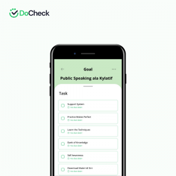

Kamu pasti tahu _stand up comedy_, kan? Bentuk komedi ini umumnya dibawakan oleh satu orang yang berbicara langsung kepada penontonya. Salah satu _skill_ terpenting yang dibutuhkan untuk membawakan komedi semacam ini adalah _public speaking_. Baca sampai akhir untuk mengetahui 5 tips public speaking ala Kylatif.

_Stand up comedy_ adalah bentuk komunikasi satu arah – sebuah bentuk komunikasi yang berlangsung satu pihak saja karena komunikannya bersifat pasif. _Public speaking skills_ tidak hanya bermanfaat untuk bentuk komunikasi tersebut. Lebih daripada itu, kemampuan ini sangat diperlukan ketika kamu berbicara di depan banyak orang.

Walaupun kita sebagai manusia pasti berkomunikasi setiap hari, nyatanya berbicara di depan umum adalah hal yang lumayan sulit untuk dilakukan. Salah satu masalah yang sering kali muncul ketika berbicara di depan umum adalah _nervous_ atau gugup.

## Tips Public Speaking yang Baik

Nah, Rizky Fauzy Latif atau yang kerap dikenal sebagai Kylatif punya _to-do list_ agar _public speaking skills_ kamu lancar. Pada gelaran _Be A POP Star Webinar_ yang dilaksanakan Kamis, 21 Oktober 2021, _content creator_ yang kerap membahas _public speaking_ ini membeberkan 5 hal yang bisa membuat _public speaking skills_ kamu jadi lebih lancar! Apa saja ya kira-kira?

### 1\. Self Awareness

Segala sesuatu memang harus dimulai dari diri sendiri. Nah, dalam _public speaking_, hal ini juga berlaku. Menurut Kylatif, salah satu hal yang bisa menjadikan _public speaking_ kamu lebih baik adalah _self-awareness_.

Proses mengenali diri sendiri ini melibatkan pemahamanmu atas potensi, kelebihan dan kekurangan, serta pola pikir dirimu sendiri. Orang dengan tingkat _self-awareness_ lebih tinggi cenderung lebih baik dalam bekerja dan lebih efektif jika menjadi pemimpin. Tak heran jika kemudian _self-awareness_ menjadi penting ketika akan berbicara di depan publik.

Tasha Eurich, penulis buku _The Power of Self-Awareness in a Self-deluded World_, menemukan bahwa 95% orang merasa dirinya _self-aware_, tapi hanya 10-15% yang benar-benar seperti itu. Nah, untuk meningkatkan _self-awareness_, kamu bisa memulainya dengan membaca buku karya Tasha Eurich tersebut.

### 2\. Bank of Knowledge

Penting untuk menjadi kredibel pada saat berbicara di depan publik. Informasi yang kamu berikan harus bisa dipertanggungjawabkan. Oleh karena itu, memiliki pengetahuan mengenai apa yang kamu bicarakan adalah sebuah keharusan.

Aristoteles menyebut kredibilitas ini sebagai _ethos_. Menurutnya, penyampaian pidato atau retorika oleh orang yang kredibel akan lebih persuasif. Nah, salah satu ciri orang kredibel adalah memiliki kemampuan atau keahlian di bidang yang dibicarakannya. Maka, memahami topik yang kamu bawakan ketika berbicara di depan umum adalah keharusan.

Banyak cara untuk memperoleh pengetahuan mengenai sebuah topik. Misalnya dengan membaca, menonton, dan berdiskusi dengan orang yang kompeten dibidangnya. Nah, Kylatif punya buku tentang _public speaking_ yang berjudul _Seni Bicara Teratur_. Kamu bisa membaca buku ini jika ingin mendapatkan pengetahuan mengenai _skill_ tersebut.

### 3\. Learn the Techniques Speaking Skills

Dua hal pertama yang bisa membuat _public speaking_ kamu lebih baik tadi, belum berhubungan langsung dengan bagaimana cara berbicaranya itu sendiri. Nah, sekarang kamu harus mulai mencari dan mempelajari teknik-teknik berbicara di depan umum. Misalnya, bagaimana membuat audiens kondusif dan menjawab pertanyaan dengan jelas.

Dalam mempelajari sesuatu, kamu memang selalu bisa belajar sendiri. Termasuk mempelajari teknik praktis _public speaking_ ini. Namun, akan lebih efektif lagi jika kamu belajar dengan didampingi orang yang lebih kompeten. Untuk itu, kamu bisa mengikuti komunitas, kursus, atau belajar langsung dari _expert_. Salah satu _platform_ yang wajib kamu kunjungi pada saat mempelajari _skill_ ini adalah [_Toastmasters_](https://www.toastmasters.org/).

### 4\. Practice Makes Perfect

Kylatif menyebutkan bahwa kunci utama dari jago _public speaking_ adalah 6L alias latihan, latihan, latihan, lagi-lagi latihan. Ambil kesempatan berbicara di depan umum untuk dapat dijadikan pengalaman. Jadikan kesempatan tersebut sebagai sarana latihan kamu. _Practice makes perfect._

### 5\. Support System

_Support system_ penting dalam menumbuhkan rasa percaya diri kamu. Bayangkan jika kamu terjebak dalam kondisi yang mengharuskanmu untuk berbicara di depan umum, namun kamu takut untuk melakukannya. Kalau kamu punya support system, mereka akan tetap mendukungmu. Oleh karena itu, _support system_ ini sangat penting untuk meningkatkan kepercayaan diri kamu.

Gimana nih sekarang? Kamu sudah tahu kan apa yang harus dilakukan untuk meningkatkan kemampuan _public speaking_? Biar gak lupa, kamu bisa mendapatkan _to-do list_ ini di aplikasi DoCheck dalam bentuk _predefined goal_.

Kalau kamu ingin memiliki kemampuan _public speaking_ seperti Kylatif, segera _download_ aplikasi DoCheck di [Google Play Store](https://play.google.com/store/apps/details?id=com.docheck.docheck) dan [App Store](https://apps.apple.com/id/app/docheck-to-do-list-app/id1603424606?l=id) sekarang. Gratis!
