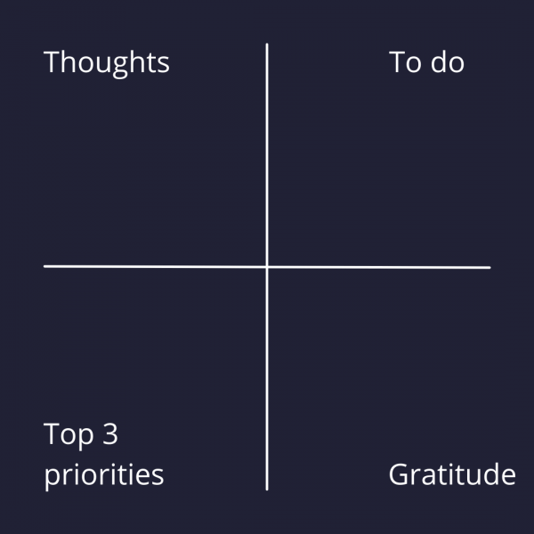

Brain Dump – Kamu mengikuti serial _Fantastic Beast_? Sekuel ketiga dari seri tersebut akan mulai tayang di bioskop Amerika pada 15 April 2022. Kemunculan trailer kedua pada 28 Februari kemarin sukses menarik perhatian publik.

Salah satu yang jadi bahan perbincangan publik adalah Johnny Depp akan digantikan oleh Mads Mikkelsen dalam memerankan tokoh Grindelwald. Banyak _potterhead_ (sebutan untuk fans Harry Potter) yang menyayangkan hal ini.

_Nah_, _gimana nih_, apakah hal ini akan mengurungkan niat kamu untuk menonton film ini? _Hmm_… Kalau kamu _potterhead,_ harus tetap nonton, _sih_.

Seri ini masih satu _universe_ dengan seri Harry Potter, hanya saja berbeda setting waktu. Rangkaian kejadian di film ini terjadi jauh sebelum era Harry Potter. Maka, wajar jika banyak penonton film ini adalah penggemar dari seri Harry Potter.

Ngomong-ngomong soal seri Harry Potter, ada sebuah adegan menarik di film ke-empatnya – _Harry Potter and the Goblet of Fire_. Adegan tersebut adalah ketika Harry menyaksikan Dumbledore menggunakan _[Pensieve](https://harrypotter.fandom.com/wiki/Pensieve)_ untuk menyimpan ingatan ke dalam sebuah _vial._ Ia kemudian berkata kepada Harry:

> _“I use the Pensieve. One simply siphons the excess thoughts from one’s mind, pours them into the basin, and examines them at one’s leisure. It becomes easier to spot patterns and links, you understand, when they are in this form.”_
>
> Dumbledore dalam _Harry Potter and the Goblet of Fire_.

Dalam kehidupan nyata, apa yang dilakukan oleh Dumbledore ini hampir sama dengan sebuah kegiatan yang bernama _brain dump_.

Dumbledore denga _Pensieve_ di sebelah kirinya. Gambar dari [YouTube](https://www.youtube.com/watch?v=BlhpM3O1Ejw).

## _Brain dump_, apa itu?

_Brain dump_ adalah kegiatan mengeluarkan isi pikiran dari kepala dengan cara memindahkannya ke media lain yang melibatkan proses menulis. Bentuknya dapat berupa beberapa hal, seperti _[to-do list](https://docheck.id/pentingnya-to-do-list-untuk-manajemen-waktu/)_, _mind map_, atau [jurnal](https://docheck.id/journaling-pengertian-dan-manfaatnya/). Hal ini dilakukan dengan tujuan untuk mengurangi pikiran berlebihan sehingga kamu dapat melihatnya secara lebih objektif.

Dengan menuliskan pikiran, kamu akan lebih mudah untuk menemukan keterkaitan dan pola. Sehingga, kamu akan lebih mengerti dengan apa yang sedang kamu hadapi, persis seperti apa yang dikatakan oleh Dumbledore. Lebih jauh, kegiatan ini bisa meringankan beban pikiranmu sehingga kecemasan dan ketakutan akan berkurang.

**Baca Juga: [5 Keunggulan Membuat To-do List, Bentuk Nyata Hargai Waktu](https://docheck.id/5-keunggulan-membuat-to-do-list-bentuk-nyata-hargai-waktu/)**

## Mengapa Kamu Harus Melakukan _Brain Dump_?

Sebuah [studi](https://www.health.harvard.edu/blog/write-your-anxieties-away-2017101312551) menemukan bahwa melepaskan kekhawatiran ke dalam bentuk tulisan bebas, bisa melepaskan beban mental. Sehingga kondisi mentalmu yang bebas dari beban tersebut bisa digunakan sepenuhnya untuk menyelesaikan tugas dengan lebih baik dan mudah.

_Brain dump_ efektif karena membuat pikiran dan perasaanmu menjadi lebih nyata. Ketika semuanya menjadi lebih jelas, maka kamu akan lebih mudah dalam mencari solusi yang mungkin sebelumnya belum terlihat olehmu. Dengan menuliskan kekhawatiran yang ada di pikiran, kamu akan menjadi lebih fokus, tidak terlalu cemas, dan lebih produktif.

Kamu bisa melakukan _brain dump_ di pagi hari untuk mengorganisir hari, atau malam hari pada saat sedang _[overthinking](https://docheck.id/overthinking-apa-dan-penyebabnya/)_. Kamu akan mengambil keputusan yang besar? Ada baiknya melakukan _brain dump_ terlebih dahulu. Seminggu sekali, cobalah lakukan _brain dump_ agar pemikiran di minggu ini bisa bersih sehingga nanti lebih siap dalam menghadapi minggu selanjutnya.

## Bagaimana Cara Melakukan _Brain Dump_?

Sebenarnya, ada [beberapa cara untuk melakukan _brain dump_](https://psychcentral.com/pro/recovery-expert/2020/04/using-brain-dumping-to-manage-anxiety-and-over-thinking#4). Dari mulai sesederhana menuliskan pikiran di atas kertas (_basic brain dump_), hingga yang paling populer seperti _the four square brain dump._ Terus, _gimana_ cara untuk melakukan _four square brain dump_ ini? Tenang, kamu _gak_ butuh _Pensieve_ kayak Dumbledore, _kok_!

Hal pertama yang harus kamu lakukan adalah menyiapkan buku. Pada halaman kosong, buatlah garis horizontal dan vertikal yang saling memotong satu sama lain di tengah halaman kosong tersebut layaknya seperti kordinat kartesius. Dengan ini, kamu telah berhasil membuat 4 kuadran yang nantinya akan dinamai _thoughts, to do, gratitude,_ dan _top 3 priorities_. Berikut ini penjelasan isi dari masing-masing kuadran tersebut:

1. **_Thoughts_**: berisi pikiran _random._ Jangan terlalu memikirkan hal ini pada saat kamu menuliskannya.
2. **_To do_**: berisi semua hal yang harus kamu lakukan atau capai. Singkatnya, kuadran ini berisi _to-do list_.
3. **_Gratitude_**: Berisi hal-hal yang kamu syukuri.
4. **_Top 3 priorities_**: Coba lihat kembali _to-do list_ pada kuadran kedua, cari tahu 3 hal yang sangat penting bagimu. Tuliskan hal tersebut di kuadran ini.

Ilustrasi four quarter brain dump.

Ternyata, cara yang dilakukan Dumbledore jika diterapakan dalam kehidupan sehari-hari akan membuat pikiran kamu lebih jernih. Dengan begitu, kamu bisa lebih mudah dalam menemukan solusi dan tidak cemas atau khawatir pada saat akan melakukan sesuatu. Semua ini pada akhirnya akan membuat kamu [lebih produktif](https://docheck.id/meningkatkan-produktivitas-di-tahun-baru-cek-to-do-list-ini/).

_Eits_, tapi _gak_ cuma _brain dump loh_ yang bisa bikin kamu lebih produktif. Aplikasi DoChek juga bisa bikin kamu lebih produktif! Di aplikasi ini, kamu bisa menentukan _goals_ beserta *to-do list-*nya. Tak hanya sampai situ, fitur _tracking progress_ yang ditawarkan juga akan membuatmu lebih mudah dalam memantau sudah sejauh mana progres kamu terhadap sebuah tujuan.

**Baca Juga: [Kembangkan Diri dan Hidup Berkualitas bersama DoCheck App](https://docheck.id/kembangkan-diri-dan-hidup-berkualitas-bersama-docheck-app/)**

Tunggu apa lagi? Yuk, segera _download_ aplikasi DoCheck di [Google Play Store](https://play.google.com/store/apps/details?id=com.docheck.docheck) dan [App Store](https://apps.apple.com/id/app/docheck-to-do-list-app/id1603424606?l=id), sekarang! Gratis!
