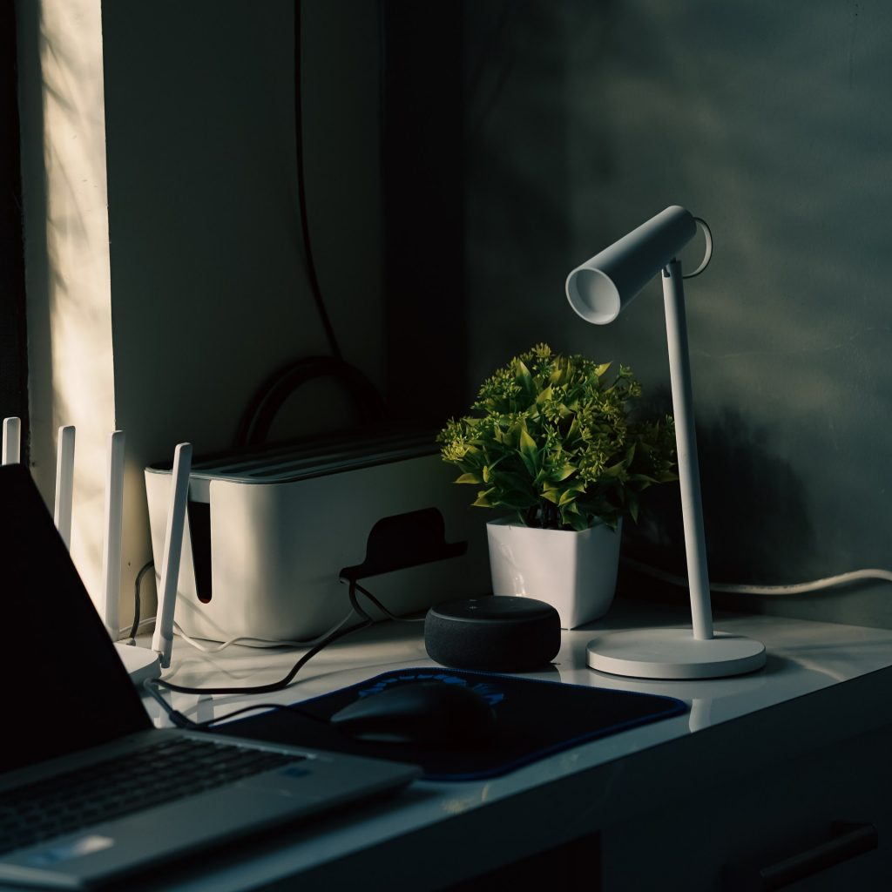

_Gak_ kerasa ya udah 2022? Kamu udah melakukan [refleksi diri](https://docheck.id/self-reflection-cara-untuk-bersyukur-dan-mengenal-diri/) _kan_ di akhir tahun kemarin? _Nah_, di tahun sekarang, kamu harus lebih baik dari tahun sebelumnya, ya! Bagaimana cara agar produktif setiap harinya?

Salah satu cara agar lebih produktif di tahun ini, kamu bisa memulainya dengan hal-hal kecil. Misalnya, dengan mulai berhenti bergadang agar bangun lebih pagi. Kebiasaan kecil semacam itu, jika dilakukan akan membuat produktivitas kamu meningkat.

Jadi, sebenarnya cara agar hidup produktif itu _gak_ butuh _effort_ besar, _kok_. Bahkan, kamu tidak membutuhkan waktu atau energi yang lebih. Kamu cukup melakukan hal-hal sederhana dalam keseharianmu.

## Cara agar Produktif Setiap Hari

Kira-kira apa saja _sih_ hal-hal yang perlu kamu lakukan agar menjadi produktif di tahun ini? Tenang, MinCheck bakal kasih tau kamu, _kok_. Cek _to-do list_ cara menjadi anak muda yang produktif ini, ya!

### 1\. Mulai Berpakaian Sesuai dengan Situasi dan Kondisi

**Baca Juga: [Kegiatan Produktif Saat Liburan Nataru di Rumah Aja](https://docheck.id/kegiatan-produktif-saat-liburan-nataru-di-rumah-aja/)**

Di mana bumi dipijak, di situ langit dijunjung. Peribahasa tersebut mengingatkan kita untuk selalu menyesuaikan diri dengan tempat dan kondisi yang akan kita hadapi. Termasuk cara berpakaian. Pernahkah terlintas dipikiran kamu kalau cara menjadi produktif salah satunya dengan berpakaian rapi? Ya, kamu tidak salah, kok. Cara agar produktif yang pertama adalah dengan berpakaian rapi, kenapa demikian?

Sebuah [penelitian](https://journals.sagepub.com/doi/abs/10.1177/1948550615579462) menunjukkan, jika kamu ingin memiliki ide-ide besar di tempat kerja, maka kamu harus menggunakan pakaian formal – setelan jas. Dalam penelitian ini, subjek dibagi ke dalam dua kelompok, yang menggunakan pakaian formal dan kasual. Hasilnya, kelompok dengan pakaian formal memiliki peningkatan pemikiran abstrak yang merupakan sebuah aspek penting dari kreativitas dan penyusunan strategi jangka panjang.

Masih ada beberapa hasil penelitan lain mengenai bagaimana pakaian memengaruhi produktivitas kita. Misalnya, [penelitian](https://psycnet.apa.org/record/2014-38364-001) dalam _Journal of Experimental Psychology: General,_ mengungkapkan bahwa pakaian informal dapat mengurangi kemampuan bernegosiasi kita. Atau, yang dipublikasikan dalam _[Journal of Experimental Social Psychology](https://www.sciencedirect.com/science/article/abs/pii/S0022103112000200)_, yang menyebutkan bahwa pakaian seperti dokter dapat meningkatkan fokus.

Adanya penelitian-penelitian ilmiah seperti itu, menjadi bukti bahwa kamu harus menyesuaikan cara berpakaianmu dengan situasi dan kondisi yang harus kamu hadapi, ya!

**Baca Juga: [Produktif dengan Menonton Video 5 YouTube Channel Ini](https://docheck.id/produktif-dengan-menonton-video-5-youtube-channel-ini/)**

### 2\. Beli Monitor Kedua untuk Kerja

Siapa bilang produktivitas itu cuma bisa ditingkatkan oleh diri kita sendiri? Ternyata faktor eksternal seperti monitor juga berdampak pada produktivitas kita, _loh_! Cara agar produktif yang kedua adalah dengan menambah fasilitas penunjang, dengan itu akan mempermudah kamu dalam bekerja. Sehingga kamu menjadi produktif dalam bekerja.

[Penelitian](https://www.jonpeddie.com/press-releases/jon-peddie-research-multiple-displays-can-increase-productivity-by-42/) oleh Jon Peddie Research yang telah dilakukan semenjak 2002 menemukan bahwa, penggunaan dua monitor dapat meningkatkan produktivitas kerja hingga 42%. Hal ini wajar, karena ternyata karyawan kehilangan produktivitas rata-rata 32 hari dalam setahun karena terlalu sering berganti aplikasi. Jadi, kalau komputer kamu di rumah yang biasa dipakai untuk kerja cuma ada satu monitor, kayaknya di 2022 ini sudah waktunya untuk beli satu lagi, deh.

**Baca Juga: [Work From Home: Cara Agar Tetap Produktif Sekaligus Menyenangkan](https://docheck.id/work-from-home-cara-agar-tetap-produktif-sekaligus-menyenangkan/)**

### 3\. Stop _Multitasking_

Mengerjakan lebih dari satu hal dalam waktu yang bersamaan terdengar produktif. Tapi kamu salah, _loh_. Kenyataannya, _multitasking_ ini berbanding terbalik dengan produktivitas. Sudah banyak penelitian yang menyatakan hal ini.

Sebuah [penelitian](https://psycnet.apa.org/record/2001-07721-001) dalam _Journal of Experimental Psychology: Human Perception and Performance_ mengungkapkan, _multitasking_ membuat kita menjadi kurang efisien dan dapat menyebabkan banyak kesalahan. Hal ini dikarenakan, otak kita cenderung lebih menyukai ketika kita fokus pada satu hal. Sisi kira dan kanan otak kita akan bekerja secara harmonis dalam kondisi seperti ini. Lebih baik hindari mengerjakan sesuatu secara bersamaan supaya menjadi lebih produktif ya DoCheckers. Kamu bisa _breakdown_ beberapa pekerjaan sesuai dengan prioritasnya dengan [aplikasi D](https://play.google.com/store/apps/details?id=com.docheck.docheck&hl=en_US&gl=US)[oCheck](https://play.google.com/store/apps/details?id=com.docheck.docheck&hl=en_US&gl=US).

### 4\. Pajang Tanaman Hijau di Meja Kerja Kamu

_Foto oleh Sangeet Rao dari Pexels_

Kamu pernah lihat ada orang yang memajang tanaman kecil di meja kerjanya? Jangan merasa aneh dengan hal tersebut, ya. Karena, ternyata tujuannya adalah untuk meningkatkan produktivitas. Kok bisa?

Tempat kerja yang “hijau” dengan tanaman membuat karyawan lebih produktif daripada kantor yang sebaliknya, menurut sebuah [penelitian](https://www.sciencedaily.com/releases/2014/09/140901090735.htm). Menurut Darko Jacimovic, pendiri [What To Become](https://whattobecome.com/), alam memiliki manfaat terapeutik pada manusia, membuat kita lebih segar, mendapatkan kembali fokus, dan meningkatkan produktivitas berdasarkan sebuah teori yang bernama _[Attention Restoration](https://www.sciencedirect.com/science/article/abs/pii/0272494495900012)_.

### 5\. Mulai Berolahraga

_Foto oleh William Choquette dari Pexels_

**Baca Juga: [Aplikasi DoCheck: Makin Produktif dengan Fitur Task](https://docheck.id/aplikasi-docheck-makin-produktif-dengan-fitur-task/)**

Resolusi kamu di 2022 ingin lebih sehat? Salah satu cara termudah untuk mewujudkannya tentu dengan berolahraga. Tapi, kamu tahu _gak sih_ kalau ternyata olahraga juga merupakan cara agar hidup produktif? Jadi, hanya dengan berolahraga, dua resoulsi kamu, untuk lebih sehat dan produktif bisa terwujud secara bersamaan, _nih_.

Dalam sebuah [studi](https://www.emerald.com/insight/content/doi/10.1108/17538350810926534/full/html), olahraga dinyatakakan tidak hanya memiliki manfaat terhadap kesehatan, tetapi juga bermanfaat untuk produktivitas. Dalam penelitian ini, peserta penelitian yang berolahraga mampu mengerjakan tugas 72% lebih banyak dalam keseharian mereka. Cocok banget nih buat kamu yang pengen sehat dan menjadi lebih produktif!

Itulah beberapa _to-do list_ yang bisa bikin kamu menjadi lebih produktif di tahun baru ini. Ternyata, untuk menjadi lebih produktif, kita tidak harus mengeluarkan _effort_ banyak. Dari hal-hal yang tidak terduga dan sepele seperti memajang tanaman hijau pada meja kerja bisa meningkatkan produktivitas.

**Baca Juga: [Twitter Sepanjang 2021: Sebuah Kilas Balik](https://docheck.id/twitter-sepanjang-2021-sebuah-kilas-balik/)**

Yuk, mulai masukkan beberapa hal ini ke _to-do-list_ kamu agar _makin_ produktif di tahun ini. Jangan lupa, bikin _to-do-list_\-nya pakai DoCheck, ya! Tunggu apa lagi? Segera _[download](https://play.google.com/store/apps/details?id=com.docheck.docheck)_ aplikasi DoCheck di Google Play Store sekarang. Gratis!

Sekian dari DoCheck mengenai _to-do-list_ meningkatkan produktivitas di 2022. Semoga, resolusi kamu di tahun ini semuanya terwujud, ya!
