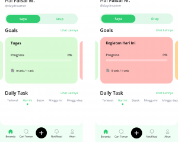
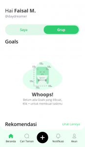
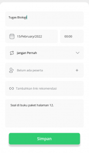
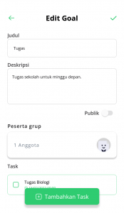
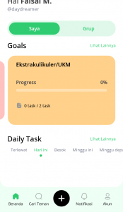
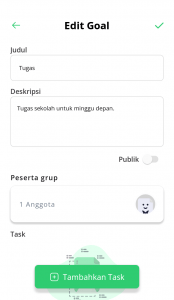
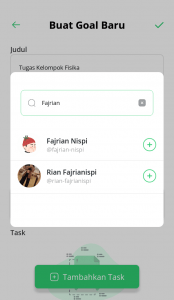
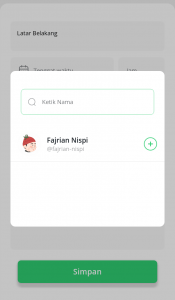
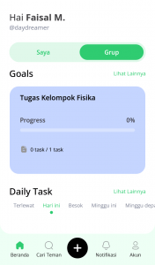

Rutinitas sehari-hari tiap orang pasti berbeda-beda. Jika kamu pelajar atau mahasiswa, pergi ke sekolah atau kampus, belajar, mengerjakan tugas, ikut ekstakurikuler atau UKM (Unit Kegiatan Mahasiswa) sudah menjadi rutinitasmu. Hal ini memang terlihat sederhana, namun bayangkan jika tugas yang harus kamu kerjakan dan UKM atau ekstrakurikuler yang kamu ikuti lebih dari satu? salah satu solusi untuk mengatasinya adalah dengan membuat _to-do list_ dengan aplikasi DoCheck.

Semakin banyak hal yang harus kamu lakukan, maka akan semakin sulit juga kamu mengatur waktu. Kebingungan pun muncul akibat dari memikirkan apa yang harus kamu lakukan terlebih dahulu.

_Nah_, kamu bisa gunakan aplikasi DoCheck untuk membuat _to-do list_\-nya. DoCheck memiliki berbagai fitur yang dapat memudahkan kamu dalam membuat _to-do list_. Jadi, cocok banget _nih_ buat mahasiswa atau pelajar dengan banyak kegiatan seperti kamu. Lalu, _gimana sih_ caranya agar kamu sebagai mahasiswa atau pelajar bisa memanfaatkan berbagai fitur yang ada di DoCheck?

## Buat _Goals_ Berkategori Tugas, Kegiatan Hari Ini, dan Ekstrakurikuler atau Unit Kegiatan Mahasiswa

Dalam metode produktivitas _Getting Things Done_ (GTD), ada langkah di dalamnya yang mengharuskan kamu untuk mengkategorikan tugas, pekerjaan, atau kegiatan. Kamu bisa mengikuti cara ini untuk menggunakan DoCheck. _Gimana_ caranya? Yuk, ikuti langkah berikut ini!

Tampilan laman utama aplikasi DoCheck.

**Baca Juga: [Getting Things Done: Sebuah Metode Mengorganisir Pekerjaan](https://docheck.id/getting-things-done-sebuah-metode-mengorganisir-pekerjaan/)**

### 1\. Buat Kategori Tugas, Ekstrakurikuler/UKM, dan Kegiatan Hari Ini

Kalau kamu pelajar atau mahasiswa, buatlah kategori “Tugas”, “Ekstrakurikuler/UKM”, dan “Kegiatan Hari Ini”. Masing-masing kategori ini akan menyimpan _task-task_ sesuai dengan nama kategorinya.

Untuk membuatnya, kamu hanya perlu menambahkan _goals_ dengan cara klik tombol “+” yang berwarna hitam di tengah bawah. Setelah itu, silahkan masukkan “Judul” _goals_\-nya sesuai dengan kategori tadi. Masukkan deskripsi yang memperjelas _goals_ tersebut. Misalnya, untuk _goal_ “Tugas”, bisa kamu masukkan deskripsi, “Tugas sekolah/kuliah untuk minggu depan”.

Membuat _goal._

### 2\. Tambahkan _Task_

Kemudian klik tombol “Tambahkan _Task_” yang berwarna hijau untuk menambahkan daftar tugasnya. Untuk _goal_ “Tugas”, kamu bisa menambahkan _task_ berupa tugas-tugas yang kamu dapatkan di sekolah atau perkuliahan. Ketikkan nama _task_\-nya sesuai dengan nama subjek pelajaran atau kuliahnya.

Masukkan juga tenggat waktu atau _deadline_ dari tugas tersebut. Kemudian, untuk keterangan tugas kamu bisa memasukkannya di dalam kolom “Catatan”. Misal, “Soal di buku paket halaman 12”. Jika sudah, klik tombol “Simpan”.

Membuat _task._

**Baca Juga: [Aplikasi DoCheck: Makin Produktif dengan Fitur Task](https://docheck.id/aplikasi-docheck-makin-produktif-dengan-fitur-task/)**

### 3\. Simpan _Goal_

Jangan lupa untuk menyimpan _goals_\-nya dengan klik tombol centang berwarna hijau yang terletak di pojok kanan atas. Jika sudah, maka _goals_ kamu akan langsung terlihat di layar utama aplikasi.

_Task_ telah selesai dibuat.

### 4\. Ulangi Langkah 1 – 3 dengan Menyesuaikan _Goals_\-nya

_Goal_ “Ekstrakurikuler”, _task_\-nya bisa kamu isi dengan hal-hal yang berhubungan dengan ekstrakurikuler. Misalkan, kamu ikut ekstrakurikuler pramuka, kemudian minggu depan akan mengadakan perjusami (perkemahan Jumat, Sabtu, Minggu), kamu bisa memasukkan “Membeli perlengkapan kemah” sebagai _task_. Jika kamu hari ini tidak ada tugas yang harus dikerjakan, maka kamu bisa memasukkan _task_ “Belajar” di _goal_ “Kegiatan Hari ini”.

_Goal_ tugas, dan kegiatan hari ini yang telah selesai dibuat.

## Buat _Goals_ Grup untuk Tugas Kelompok

Kamu punya tugas kelompok? Berarti kamu harus membuat _goals_ grup! Berikut ini langkah-langkah untuk membuatnya.

**Baca Juga: [Goals Recommendation: Bisa Bantu Capai Life Goals!](https://docheck.id/goals-recommendation-bisa-bantu-capai-life-goals/)**

### 1\. Masuk ke Dalam Daftar _Goal_ Grup

Kamu hanya perlu klik tombol “Grup” yang ada di beranda aplikasi DoCheck. Di sana kamu akan menemui semua daftar _goal_ grup kamu.

_Goal_ grup.

### 2\. Buat _Goal_ Grup

Cara untuk membuatnya hampir sama dengan _goal_ pribadi. Bedanya, pada saat membuat _goal_, kamu harus menambahkan peserta grupnya dengan cara klik tombol “+” berwarna hijau yang berada di dalam kolom “Peserta grup”. Ketikkan nama akun temanmu yang ingin kamu masukkan ke dalam _goal_ ini. Jika sudah, maka tambahkan dengan klik tombol “+” di samping profil penggunanya.

Memasukkan peserta dalam _goal_ grup.

### 3\. Tambahkan Peserta pada _Task_

Kemudian, pada saat menambahkan _task_ kamu harus sudah tahu pembagian tugas masing-masing anggota kelompok. Misal, temanmu mendapatkan tugas untuk membuat latar belakang dalam tugas kelompok membuat makalah tentang hukum _archimedes._ Maka, pada saat membuat _task_, kamu juga harus menambahkan peserta _task_\-nya. Hal ini akan memudahkanmu untuk mengetahui tanggung jawab dari tiap anggota kelompok.

Menambahkan peserta ke dalam _task_.

### 4\. Simpan _Goal_ Grup

Jika sudah, jangan lupa untuk menyimpan _goal_\-nya. Maka, otomatis _goal_ grup ini akan muncul di bagian _goals_ grup di halaman awal aplikasi DoCheck!

Goal grup sudah jadi.

**Baca Juga: [Reminder Untuk Kamu yang Pelupa, Pin Goals Bisa Bantu Kamu!](https://docheck.id/butuh-reminder-pelupa-pin-goals-bisa-bantu/)**

Gimana _nih_ aplikasi DoCheck-nya? Tentu bakal ngebantu kamu banget dong? Jadi, kalau kamu banyak kegiatan, sekarang _gak_ perlu khawatir lagi. Dengan DoCheck, manajamen waktu kamu bakal lebih baik, _kok_. _Gak_ bakal bingung lagi _deh_ harus ngerjain apa dulu. Tunggu apa lagi? Yuk, segera _download_ aplikasi DoCheck di [App Store](https://apps.apple.com/id/app/docheck-to-do-list-app/id1603424606?l=id) dan [Google Play Store](https://play.google.com/store/apps/details?id=com.docheck.docheck), sekarang. Gratis!
