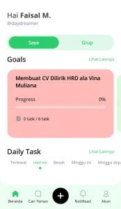
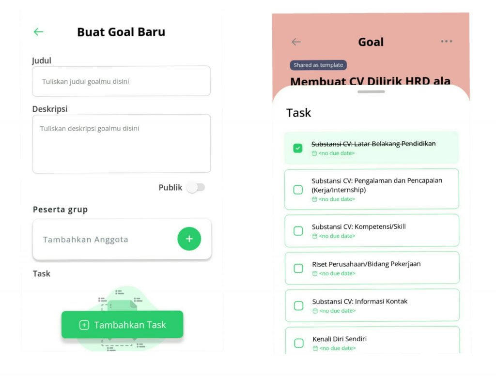
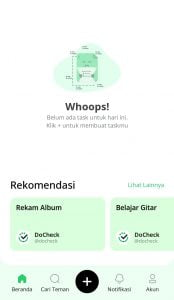
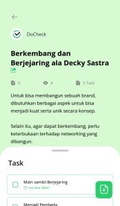

Menyusun _goals_ atau resolusi di awal tahun baru sudah menjadi ritual tahunan. Dari mulai ingin menurunkan berat badan, [membuat _habit_ baru,](https://docheck.id/habit-bagaimana-bisa-terbentuk-dan-menciptakan-yang-baik/) belajar Bahasa Inggris, dan masih banyak lagi. Tentu, _goals_ ini adalah sesuatu yang positif karena bisa menjadikanmu lebih baik dari tahun sebelumnya.

Sekarang baru masuk bulan kedua di tahun 2022, _nih_. Mungkin, selama sebulan kemarin di Januari, ada di antara kamu yang sudah berhasil mencentang salah satu _goals_ di tahun ini. Jika iya, kamu hebat, _sih_! Kalau belum, tenang, 2022 _kan_ masih panjang.

Memiliki resolusi atau _goals_ tahunan lebih dari satu adalah sesuatu yang sangat wajar. _Nah_, jika seperti itu, berarti masih banyak _goals_ yang harus kamu wujudkan di tahun ini, _kan_? Fitur aplikasi DoCheck bisa banget memudahkanmu untuk mewujudkan _goals_ kamu itu!

**Baca Juga: [Aplikasi DoCheck: Makin Produktif dengan Fitur Task](https://docheck.id/aplikasi-docheck-makin-produktif-dengan-fitur-task/)**

## Fitur “_Goals_”

Lewat fitur _“Goals”_ yang dimiliki DoCheck, kamu bisa menentukan atau menulis _goals_ beserta _to-do list_ untuk mewujudkannya. Ketika kamu membuka aplikasi DoCheck, kamu akan langsung menemukan _goals_ kamu di sana. Jika kamu belum melihatnya, kamu bisa membuatnya terlebih dahulu dengan klik tanda “+” yang tersedia di tengah bawah.

Halaman utama aplikasi DoCheck

Kamu bisa mengisi judul dan deskripsi serta menentukan publikasi dan peserta _goal_\-nya. Apakah akan kamu buat _private_, agar tidak bisa dilihat oleh pengguna lain, atau justru publik? Apakah _goal_ ini akan kamu jadikan milik kamu sendiri? Atau _goal_ kelompok?

Tentu dong, untuk mewujudkan sebuah _goal_, ada hal-hal yang perlu kamu lakukan. _Nah_, di aplikasi DoCheck, kamu bisa membuatnya dengan bentuk _to-do list_! Kamu hanya perlu klik tombol “Tambahkan Task” untuk membuatnya.

**Baca Juga: [Kembangkan Diri dan Hidup Berkualitas bersama DoCheck App](https://docheck.id/kembangkan-diri-dan-hidup-berkualitas-bersama-docheck-app/)**

Rincian _task_ seperti nama, tenggat waktu, pengulangan, peserta, _link_ rekomendasi, hingga catatan bisa kamu tentukan sendiri. Jika sudah selesai membuatnya, kamu bisa langsung menyimpan _goal_ ini. Maka, otomatis _goal_ ini akan muncul di beranda aplikasi.

_Oh_ iya, satu lagi. Jika kamu sudah menyelesaikan _task_ yang kamu buat, kamu bisa langsung mencentangnya. Dengan begitu, kamu bisa lebih mudah untuk memantau progres, sudah sedekat apa kamu dengan _goal_ tersebut. _Gimana_, keren, _kan_?

Detail _goals_ dan _to-do list_ yang sudah dicentang

Nah, _goals_ ini gak harus kamu buat sendiri, _loh_! Ada juga _goals_ menarik lain yang ditawarkan oleh DoCheck!

**Baca Juga: [DoCheck Guide: Untuk Pelajar dan Mahasiswa](https://docheck.id/docheck-guide-untuk-pelajar-dan-mahasiswa/)**

## Rekomendasi _Template Goals_

Di menu utama, ketika awal masuk aplikasi DoCheck, jika kamu _scroll_ ke bawah, kamu akan menemukan rekomendasi _goals_ yang ditawarkan DoCheck. _Goal_ seperti rekam album, belajar gitar, menulis artikel, dan masih banyak lagi, bisa kamu _copy_ untuk dijadikan _goal_ kamu. Jika memang ada beberapa yang harus kamu sesuaikan, kamu juga bisa mengeditnya.

Rekomendasi _goals_

Tidak hanya sampai situ, _goals_ rekomendasi dari DoCheck juga ada yang berasal dari _figur-figur_ terkenal, _loh_! Misalnya, _goal_ “Berkembang dan Berjejaring ala Decky Sastra”. Dengan begini, kamu bisa mengikuti cara-cara yang sudah dilakukan oleh figur-figur tersebut untuk sukses atau berhasil mencapai _goal_\-nya.

_Goal_ ala Decky Satria

Nah, itu dia tentang fitur “_goals”_ yang ada di aplikasi DoCheck. Fitur ini sangat bermanfaat dan cocok bagi kamu yang ingin lebih produktif atau memiliki resolusi di tahun ini. Fitur “_goals_” memungkinkanmu untuk lebih mudah dalam memantau progresnya.

**Baca Juga: [Guide Pakai Aplikasi DoCheck, Cocok Untuk Semua Orang](https://docheck.id/guide-pakai-aplikasi-docheck-cocok-untuk-semua-orang/)**

DoCheck juga sekarang sudah tersedia untuk iOS, loh! Jadi, tunggu apa lagi? Yuk, segera _download_ aplikasi DoCheck sekarang di [App Store](https://apps.apple.com/id/app/docheck-to-do-list-app/id1603424606?l=id) dan [Google Play Store](https://play.google.com/store/apps/details?id=com.docheck.docheck). Gratis!
