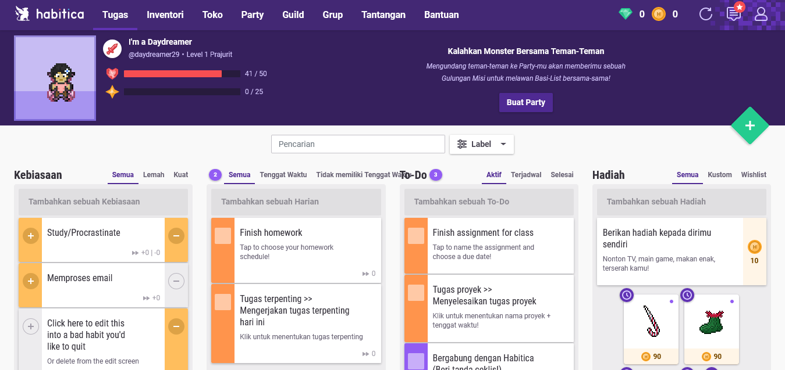
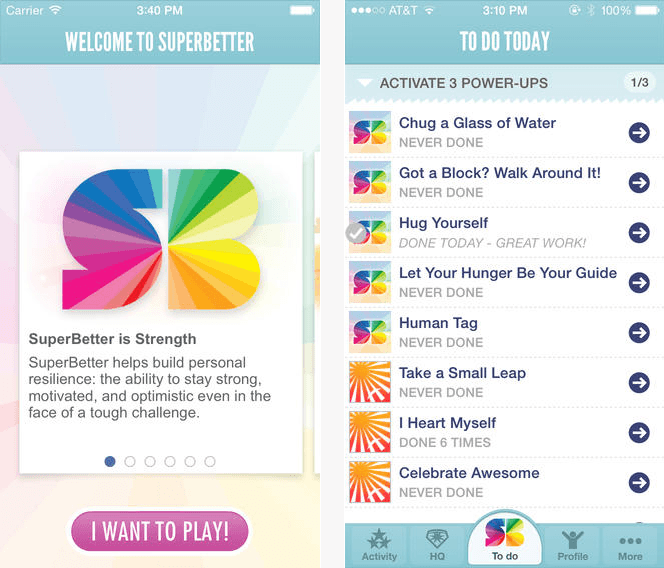
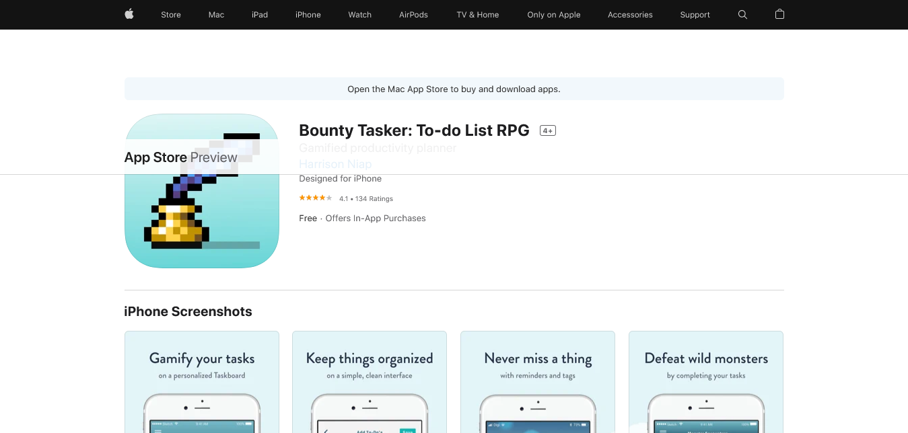
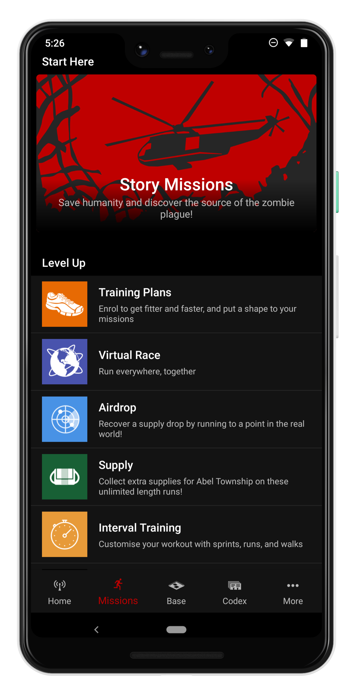
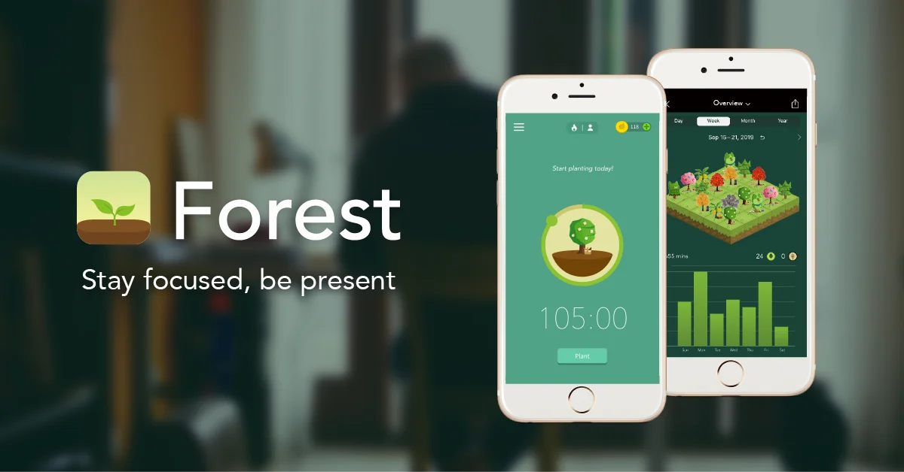

Bagi orang yang suka bermain game, mungkin akan setuju kalau kegiatan tersebut menyenangkan. Bahkan tidak hanya menyenangkan _loh_, tapi juga [bermanfaat](https://docheck.id/ragam-manfaat-bermain-video-game-online/). Salah satunya, menurut sebuah [penelitian](https://www.cbc.ca/news/canada/saskatoon/u-of-s-research-finds-video-games-can-relieve-stress-improve-mental-health-1.5563824), main _game_ terbukti bisa mengrangi stres dan meningkatkan kesehatan mental.

Sayangnya, kenyataan bahwa bermain _game_ itu menghabiskan waktu, membuat kamu berpikir dua kali sebelum melakukannya. Apalagi ketika kamu ingin memanfaatkan waktu yang dimiliki untuk sesuatu yang [lebih produktif.](https://docheck.id/meningkatkan-produktivitas-di-tahun-baru-cek-to-do-list-ini/) Misalnya dengan belajar, mengerjakan tugas kuliah atau sekolah, dan lainnya.

Namun, kegiatan-kegiatan tersebut kadang sangat melelahkan dan tidak menyenangkan untuk dilakukan. Apakah tidak bisa menggabungkan keduanya? Mendapatkan kesenangan yang berasal dari bermain game sekaligus produktif seperti mengerjakan hal-hal tersebut?

Tenang! Ternyata, ada beberapa _game_ yang bisa bikin kamu produktif, _loh_! Penasaran kan sama _game_\-nya? Yuk, simak!

**Baca Juga: [Ragam Manfaat Bermain Video Game Online](https://docheck.id/ragam-manfaat-bermain-video-game-online/)**

## Habitica

Game ini bisa merubah hidup kamu menjadi seperti permainan untuk membuatmu tetap termotivasi dan terorganisir. Kamu bisa memasukkan kebiasaan, _daily goals_, dan _to-do list_ di sini. Kamu juga bisa membuat _custom_ avatar di sini.

Menyelesaikan tugas, akan memberikanmu _reward_ berupa _item_ dalam game yang bisa memperkuat avatarmu. Habitica, memperlakukan tugas atau kebiasaan burukmu seperti ‘_monster’_ yang harus dilawan. Kamu juga bisa melawan ‘_monster_’ ini bersama teman.

Gambar dari dokumentasi pribadi

## SuperBetter

Mengutip [laman resminya](https://www.superbetter.com/), SuperBetter adalah game yang dibuat khusus untuk membangung _resilience_ atau ketahanan – sebuah kemampuan untuk tetap kuat, termotivasi, dan optimis bahkan dalam memnghadapi perubahan dan tantangan yang sulit. [Ide utama dari game ini adalah untuk membawa kekuatan psikologis dan pola pikir bermain game dalam menghadapi tantangan di kehidupan nyata](https://www.superbetter.com/science). Hal ini dinilai mampu untuk membantu kita dalam mengembangkan kebiasaan baik, mempelajari keterampilan baru, dan membuat diri kita lebih baik lagi.

Sebuah temuan dari studi terkontrol acak yang mengevaluasi aplikasi ini menyatakan bahwa bermain SuperBetter dalam 30 hari dapat meningkatkan _mood_ serta kepercayaan pada kemampuan diri dalam berhasil mencapai sebuah tujuan. Pada [penelitian lain](https://www.liebertpub.com/doi/abs/10.1089/g4h.2014.0046) yang dipublikasikan dalam _Games for Health Journal_, menemukan bahwa, SuperBetter adalah sebuah alat banttu mandiri (_self-help tool_) berbasis _smartphone_ yang dapat mengurangi gejala depresi. Pembuatnya, Jane McGonigal pernah menjelaskan mengapa SuperBetter mampu meningkatkan ketahanan _resilience_ atau ketahanan kita di TED.

**Baca Juga: [Ingin Jadi Gaming Content Creator? Cek Tips dan Trik Ini!](https://docheck.id/ingin-jadi-gaming-content-creator-cek-tips-dan-trik-ini/)**

Gambar dari dokumentasi pribadi

## Bounty Tasker: To-do List RPG

Bounty Tasker adalah game lain yang memiliki kemiripan dengan Habitica. Dalam _game_ ini kamu bisa mempersonalisasikan _taskboard_ dengan tugasmu di dunia nyata. Kamu bisa membuat _checklist_ yang jika sudah terpenuhi akan memberikanmu _reward_ berupa _equipment_ dalam _game_ yang akan memperkuat karaktermu.

Kesederhanaan dan grafis gaya 8-_bit_ yang ditawarkan game ini akan membuat pengalaman kamu dalam mengatur tugas menjadi lebih efisien dan menyenangkan!

Gambar dari dokumentasi pribadi

## Zombies, Run!

Berolahraga tentu adalah sesuatu yang produktif. Beberapa hal yang mungkin kita jadikan alasan untuk berolahraga adalah kesehatan dan menurunkan berat badan. Hasil dari olahraga memang menjanjikan, tapi sering kali kita malas dalam melakukannya karena prosesnya membosankan.

Nah, “Zombies, Run!” bisa membantu kamu. Alih-alih hanya berjalan, _jogging_, atau berlari, _game_ ini akan menempatkanmu di sebuah misi penting di dunia yang sudah dipenuhi _zombie_. Kamu hanya perlu menggunakan _earphone_ selama jalan, _jogging_, atau lari.

Dengarkan misi dan musikmu melalui _earphone_ tersebut, jika kamu dikejar zombie, maka kamu harus mempercepatnya. Secara otomatis, kamu akan diberi _reward_ persediaan untuk membangun _camp_ pengungsian.

**Baca Juga: [E-sport: Langkah Awal Berkarir Menjadi Pro Player Handal](https://docheck.id/e-sport-langkah-awal-berkarir-menjadi-pro-player-handal/)**

Gambar dari dokumentasi pribadi

## Forest

Forest adalah _game_ yang bisa membantu kamu fokus kepada hal-hal penting di hidup. Kamu bisa menanam pohon digital di _game_ ini. Ingin fokus? Bisa memulainya dengan menanam pohon di _game_ ini. Pohonmu akan tumbuh, jika kamu tetap fokus pada apa yang sedang kamu kerjakan. Meninggalkan _game_, akan membuat pohonmu mati.

Gak hanya kamu bisa fokus dengan Forest, [tapi _game_ ini juga bekerja sama dengan organisasi penanaman pohon asli](https://www.forestapp.cc/), _loh_! Jadi, setiap kamu menghabiskan koin yang kamu dapatkan di*game*\-nya untuk menanam pohon di dunia nyata, tim Forest akan mendonasikannya untuk membuat pesanan penanaman. Kamu bisa tetap fokus sembari menjaga lingkungan _deh_ kalau gini!

Gambar dari dokumentasi pribadi

Itulah beberapa _game_ yang bisa membuat kamu lebih produktif. Dengan bantuan dari _game_–_game_ tersebut, kegiatan produktifmu akan semakin menyenangkan. Cocok banget _deh_ buat yang suka bermain _game_!

Oiya, kalau kamu suka bermain, _game_ dan tertarik dengan dunia _gaming content creator_, mending ikutan #BeAPOPStarWebinar: “_A Guide to Becoming Gaming Content Creator_”, _deh_. Nanti bakal ada MomoChan sebagai narasumbernya! _Nah_, webinar ini akan diadakan lewat Zoom pada Kamis, 27 Januari 2022 pukul 19.00 – 20.30. Jangan lupa daftar [di sini](http://bit.ly/BeAPOPStarMomoChan), ya! Gratis!

**Baca Juga: [Gaming Content Creator: Momo Chan, dari Caster Hingga Brand Ambassador](https://docheck.id/gaming-content-creator-momo-chan-dari-caster-hingga-brand-ambassador/)**

Tau gak apalagi yang bisa bikin produktif, menyenangkan dan tentunya gratis? Benar banget, aplikasi DoCheck! Dengan aplikasi DoCheck, kami bisa membuat _goals_ sekaligus membuat _[to-do list](https://docheck.id/pentingnya-to-do-list-untuk-manajemen-waktu/)_ yang dibutuhkan untuk mencapainya. Kamu juga akan diberikan rekomendasi-rekomendasi yang akan memudahkanmu mewujudkan _goals_ tersebut. Tunggu apa lagi? Yuk, segera _[download](https://play.google.com/store/apps/details?id=com.docheck.docheck)_ DoCheck di Google Play Store sekarang!
