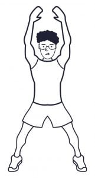
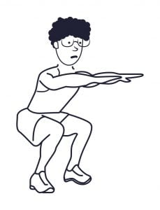
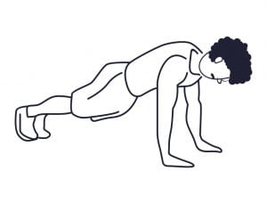
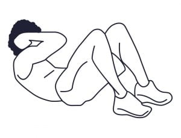
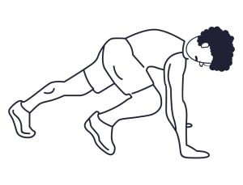
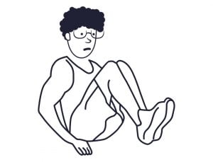
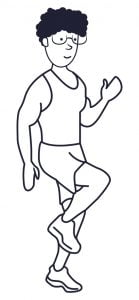

Workout – Kemunculan varian _Omicron_ membuat kasus Covid-19 di Indonesia mengalami kenaikan lagi. Kondisi ini memaksa beberapa kota untuk mulai memberlakukan PPKM. Banyak kantor yang kemudian kembali menerapkan _[work from home](https://docheck.id/work-from-home-cara-agar-tetap-produktif-sekaligus-menyenangkan/)_.

Kantor kamu _gimana_, _nih_? Kalau kamu salah satu orang yang WFH, jangan bosen, ya! Banyak banget _kok_ kegiatan yang bisa kamu lakukan di rumah. Jadi, jangan jadikan ini sebagai halangan untuk tidak produktif.

Salah satu kegiatan produktif sekaligus bikin kamu fit adalah olahraga! _Eits_, tapi _kan_ olahraga identik dengan kegiatan _outdoor_? _Jogging_, sepak bola, dan bersepeda semuanya _outdoor_. Terus, olahraga kayak apa yang bisa dilakukan sendiri di rumah dan tentunya bikin fit? Tenang, _nih_ kita punya _to-do list_ WFH alias _Workout From Home_!

**Baca Juga: [Olahraga, Gaya Hidup Sehat untuk Kesehatan Mental](https://docheck.id/olahraga-untuk-kesehatan-mental/)**

## _Jumping Jacks_ (10 Kali)

_Jumping jacks._

Jonathan Mike, seorang profesor ilmu dan performa olahraga di Grand Canyon University, mengatakan bahwa _jumping jack_ memiliki banyak manfaat. Diantaranya adalah meningkatkan mobilitas, aliran darah, dan gerakan sendi secara keseluruhan. _Gak_ cuma sampai situ, menurut sebuah [studi](https://www.hindawi.com/journals/bmri/2014/191797/) pada tahun 2014, _jumping jack_ juga dinilai mampu meningkatkan beberapa parameter kesehatan jantung pada pria obesitas.

## _Squats_ (5 Kali)

_Squats._

Cedera saat berolahraga adalah hal yang sering terjadi. Namun, tidak semua dapat dikaitkan dengan ketidakseimbangan dan kelemahan. _Nah_, _squat_ bisa meningkatkan stabilitas lutut dan pinggul yang dapat membantu mengatasi banyak masalah terkait ketidakseimbangan. Dengan begitu, kalau kamu melakukan _squat_ sebagai pemanasan maka akan menurunkan peluangmu untuk cedera pada saat melakukan olahraga seletalahnya.

_Squat_ juga telah terbukti dapat meningkatkan hormon, terutama yang berhubungan dengan pertumbuhan. Mumpung _work from home_, yuk mulai _dirutinin squat_\-nya.

## _Push-ups_ (5 Kali)

_Push-ups._

Sebuah [penelitian](https://journals.lww.com/joem/Abstract/2010/01000/The_Cost_of_Poor_Sleep__Workplace_Productivity.13.aspx) pada tahun 2010 tentang produktivitas dan kualitas tidur menunjukkan hasil bahwa kualitas tidur yang buruk dapat menurunkan produktivitas. _Nah_, kalau kamu termasuk orang yang susah tidur belakangan ini, mungkin _push-up_ akan membantumu.

_Kok_ bisa, _sih_? Tentu bisa dong, karena pada sebuah [studi](https://link.springer.com/article/10.1007/s00421-011-2219-2) yang dipublikasikan dalam _European Journal of Applied Physiology_ menemukan bahwa satu sesi latihan ketahanan seperti _push-up_, secara signifikan dapat membantu orang dewasa untuk mengurangi frekuensi bangun pada saat tidur sepanjang malam. Yuk, golongan susah tidur, mendingan pada _push-up._

## _Cross Crunches_ (10 Kali)

_Cross crunches._

Gerakan ini cocok banget _nih_ buat kamu yang pengen punya perut “kotak-kotak”, karena latihan ini melibatkan otot perut. Ketika kamu memasukkan latihan ini dalam daftar latihan harian, kekuatan inti yang dibutuhkan untuk melakukan latihan lain seperti plank dan sit-up akan terbangun. Kalau kamu masih baru mulai _workout_, _cross crunch_ adalah salah satu opsi latihan paling baik!

## _Climbers_ (10 Kali)

_Climbers._

Latihan ini adalah salah satu _exercise_ yang “komplit”. Pada saat melakukan _climbers_, hampir seluruh bagian tubuh bergerak. Maka dari itu, efeknya adalah hampir sama dengan saat kamu mendapatkan latihan seluruh tubuh. Paket lengkap _kan climbers_ ini?

Bahu, lengan, dada, semuanya bergerak pada saat kamu melakukan latihan ini. Karena _climbers_ merupakan latihan _cardio_, maka kamu akan mendapatkan manfaat kesehatan jantung sekaligus membakar kalori.

## _Knee Pull-ins_ (5 Kali)

_Knee pull-ins_.

Olahraga sambil rebahan? Ya, jelas bisa dong! _Knee pull-in_ ini salah satu latihan yang posisinya rebah. Jadi, bakalan cocok _sih_ kalau kamu termasuk kaum rebahan.

Seperti olahraga kebanyakan lainnya, _knee pull-in_ juga memiliki berbagai macam manfaat. Salah satunya adalah dapat mengurangi atau mencegah nyeri punggung. Namun, bukan berarti kalau kamu sedang sakit atau nyeri punggung, saat itu juga kamu langsung melakukan _knee pull-in_, ya!

## _High Knees_ (10 Kali)

_High knees_.

Latihan ini termasuk ke dalam _[cardiovascular exercise](https://www.healthline.com/health/fitness/high-knees-benefits#benefits)_. Ketika kamu melakukannya dengan ritme cepat dan penuh semangat, latihan ini dapat membakar sekitar 7 kalori per menit. Jika kamu melakukannya dalam ritme yang sedang, sekitar 3,5 – 7 kalori per menit bisa kamu bakar.

Manfaat lainnya dari _high knee_ adalah dapat meningkatkan kekuatan tubuh bagian bawah kalau kamu melakukannya dengan intensitas yang tinggi. Menurut penelitian pada tahun 2015, berlari di tempat, yang memiliki kemiripan dengan _high knee_ dapat membantu memperbaiki postur tubuh.

_Gak_ ada alasan lagi buat _gak_ produktif selama WFH. Olahraga yang identik dengan kegiatan _outdoor_ pun bisa kamu lakukan di rumah. Jadi, seharusnya kegiatan lain juga bisa. Dengan begitu, selain produktif, kamu juga akan tetap fit! Yuk, mulai _workout_!

Di aplikasi DoCheck sudah tersedia _to-do list_ _workout from home_ ini, _loh_! Jadi, kamu bisa langsung _copy_ _template_\-nya untuk dijadikan _goal._ Tunggu apa lagi? Yuk, segera _download_ aplikasi DoCheck di [App Store](https://apps.apple.com/id/app/docheck-to-do-list-app/id1603424606?l=id) dan [Google Play Store](https://play.google.com/store/apps/details?id=com.docheck.docheck) sekarang. Gratis!
