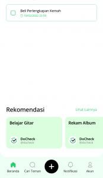
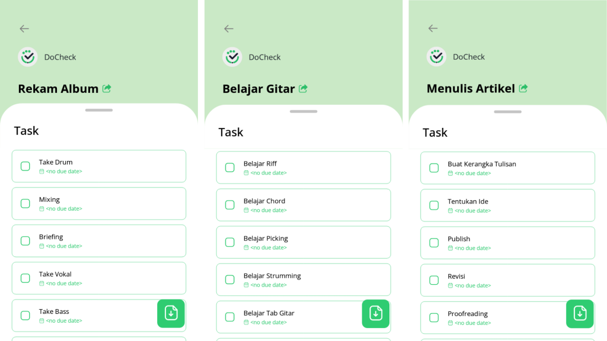
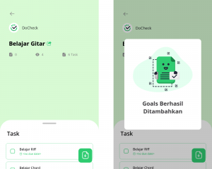
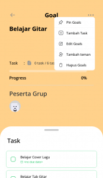

Life goals – Pasti ada masa di mana kamu mencari jati diri dalam hidup. “Aku mau jadi apa ya nanti?”, “Aku mau seperti apa ya nanti?”, “Kira-kira kalau aku seperti ini, aku bakal gimana, ya?”, dan pertanyaan-pertanyaan lain terkait diri sendiri pasti selalu muncul di kepala pada saat kamu mencari jati diri.

Hal tersebut wajar. Kebingungan semacam itu pasti tidak hanya dialami oleh kamu saja. Menentukan tujuan hidup dan langkah ke depan memang tidak pernah mudah.

Manusia sebagai mahluk sosial, pasti berinteraksi dengan orang lain. Dalam interaksi sosial, ada yang dinamakan dengan identifikasi dan imitasi. Identifikasi adalah proses pengadopsian atau pengambilan perilaku, nilai, keyakinan, dan sikap orang lain yang kamu amati. [Berbeda dengan imitasi, identifikasi melibatkan sejumlah perilaku, sedangkan imitasi hanya meniru satu perilaku saja](https://www.simplypsychology.org/bandura.html).

Identifikasi dan imitasi tidak hanya sebatas berlaku pada saat meniru perilaku orang di sekitarmu seperti ayah, ibu, teman, dan lain sebagainya. Tetapi juga berlaku untuk figur yang kamu lihat di media, bahkan karakter fiksi sekalipun. Jadi _gak_ heran _kan_ kenapa orang yang sering nonton bola kemudian punya _life goals_ menjadi pemain bola. Atau, orang yang sering baca novel punya _life goals_ menjadi penulis.

Tapi, kamu suka bingung _gak_, _sih_? Ketika sudah tahu _life goals_ atau tujuan hidup, tapi malah _gak_ tahu _gimana_ cara mewujudkannya. _Nah_, kalau kamu termasuk salah satu orang yang seperti itu, fitur rekomendasi _goals_ dari DoCheck bakal ngebantu kamu banget, _loh_!

**Baca Juga: [Goals List Membuatmu Mencapai Tujuan](https://docheck.id/goals-list-membuatmu-mencapai-tujuan/)**

## Fitur _Goals Recommendation_

Tentu, kamu bisa membuat _goals_ sendiri di aplikasi DoCheck. Namun, lewat fitur rekomendasi _goals_, kamu tidak perlu repot-repot membuatnya. Terlebih, jika kamu sendiri tidak tahu apa yang diperlukan untuk mencapai tujuan tersebut.

Misalnya, kamu punya _goal_ ingin mempunyai album sendiri, tapi kamu tidak tahu apa saja yang diperlukan untuk membuat sebuah album. _Nah_, di sinilah fitur rekomendasi _goals_ akan sangat membantumu karena _task_\-nya sudah dibuat. Jadi, kamu tinggal _copy_ saja _goal_\-nya, nanti otomatis akan masuk ke dalam daftar _goals_ kamu.

Dengan begitu, kamu tidak akan bingung lagi mengenai _step-step_ dalam membuat album. Rekomendasi _goals_ ini masih bisa kamu _edit_ ketika sudah di-_copy_. Jadi, kamu masih bisa banget buat menyesuaikan _task_\-nya jika dirasa masih ada yang terlewat atau tidak perlu menurutmu.

Di halaman beranda aplikasi DoCheck, jika kamu _scroll_ ke bawah, kamu akan menemukan rekomendasi _goals_\-nya. Berbagai macam _goals_ bisa kamu temukan. Dari mulai rekam album, belajar gitar, hingga menulis artikel. Rekomendasi _goals_ ini akan selalu ditambahkan secara berkala oleh DoCheck.

Rekomendasi _goals_ rekam album, belajar gitar, dan menulis artikel.

Untuk menyalin _goals recommendation_ tersebut, kamu bisa ikuti cara berikut ini:

### 1\. Cari Bagian Rekomendasi

Bagian rekomendasi.

Di halaman beranda aplikasi DoCheck, _scroll_ ke bawah hingga kamu menemukan bagian rekomendasi. Lalu, klik “Lihat Lainnya”.

### 2\. Pilih Goals

Daftar _goals recommendation_.

Kamu akan melihat beberapa _goals_ rekomendasi. Pilih salah satu sesuai dengan keinginanmu, kemudian klik _goal_ tersebut.

### 3\. Salin (_Copy_) Goals

_Goals recommendation_ belajar gitar dan pemberitahuan bahwa _goal_ telah berhasil disalin.

Salin _goal_ dengan klik _icon_ kertas dengan tanda panah mengarah ke bawah, di pojok kanan bawah. Akan ada pemberitahuan jika _goal_ sudah berhasil disalin.

### 4\. Edit Goals

_Goals recommendation_ yang sudah berhasil disalin.

Jika kamu mau menyesuaikan _goal_\-nya, kamu bisa mengeditnya dengan cara klik _icon_ titik tiga di pojok kanan atas.

### 5\. Pilih Edit goals

Menyunting _goals recommendation_.

Muncullah beberapa menu. Pilih “Edit _Goals_” untuk menyesuaikan _goal_ yang telah kamu salin tadi.

## Goals Recommendation dari Figur Inspiratif

Kamu punya idola atau seorang tokoh yang kamu jadikan sebagai _role model_? Kamu perlu tahu jika fitur rekomendasi _goals_ juga menyediakan _goals_ dari figur-figur inspiratif, _loh_! Dengan begini, kamu bisa mengikuti cara yang dilakukan figur tersebut untuk mencapai sebuah _goals_.

**Baca Juga: [Figur Paling Inspiratif Selama 2021 Versi DoCheck](https://docheck.id/figur-paling-inspiratif-selama-2021-versi-docheck/)**

Misalnya, _goal_ “Berkembang dan Berjejaring ala Decky Sastra”. _Task-task_ di dalamnya langsung diberikan oleh [Decky Sastra](https://docheck.id/brand-lokal-rawtype-riot-dan-prestasi-decky-sastra/) sendiri. Dengan begitu, kamu bisa lebih yakin jika _task-task_ ini efektif untuk mencapai tujuan tersebut.

Rekomendasi _goals_ dari Decky Sastra.

Selain Decky Sastra, ada beberapa figur lain yang _to-do list_\-nya bisa kamu temukan di aplikasi DoCheck. Beberapa figur tersebut adalah Vina Muliana, Farhan Jijima, Ghania Harsono, sampai Indra Sugiarto.

Fitur rekomendasi _goals_ ini akan sangat membantu bagi siapapun. Terlebih untuk kamu yang mempunyai _goals_ namun bingung bagaimana cara untuk mewujudkannya. _Goals_ rekomendasi juga masih bisa kamu _edit_, jadi akan memudahkanmu untuk menyesuaikannya.

Tunggu apa lagi? Yuk, segera _download_ aplikasi DoCheck di [Google Play Store](https://play.google.com/store/apps/details?id=com.docheck.docheck) dan [App Store](https://apps.apple.com/id/app/docheck-to-do-list-app/id1603424606?l=id), sekarang. Gratis!
