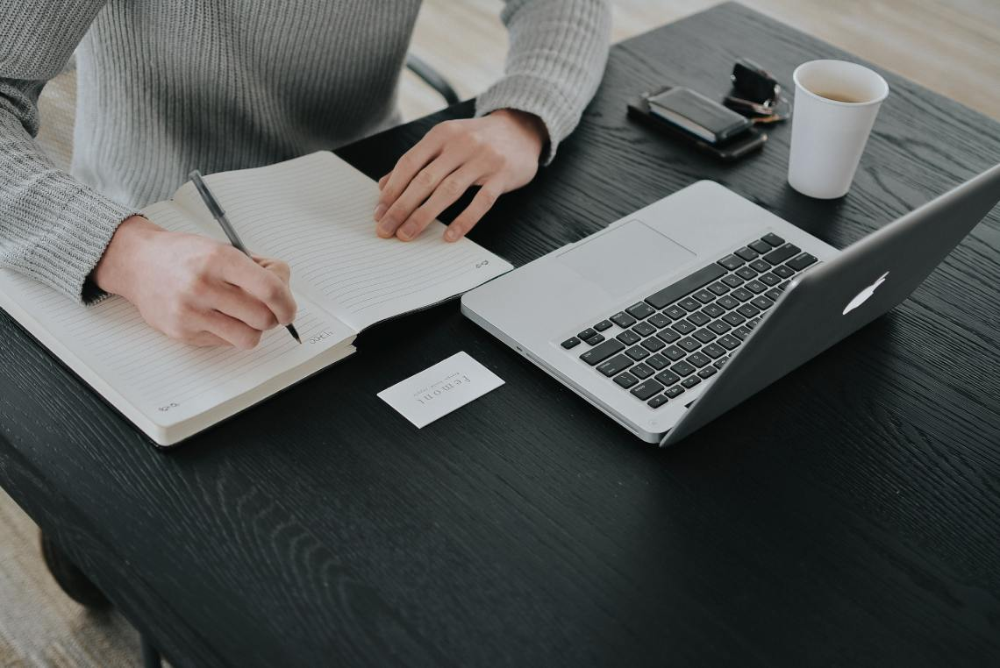
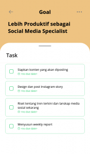

Kamu pernah ngejar _deadline_ gak, sih? Atau mungkin ngerjain sesuatu tapi berlomba dengan waktu? Suka repot gak kalau lagi berada di situasi kayak gini? Belum lagi kalau kerjaan tersebut lebih dari satu. Makin ribet pasti. Nah, kamu punya cara tersendiri gak sih supaya semuanya selesai tepat waktu? Dhila, kali ini mau berbagi cerita sama kamu, nih. Tentunya, mengenai pekerjaan _social media specialist_ sepertinya, _deadline_ bukanlah sesuatu yang asing. Setiap hari ia selalu bersinggungan dengan hal tersebut karena pekerjaannya.

Dibalik konten-konten DoCheck yang kamu nikmati, ada Dhila yang selalu konsisten dalam mengunggahnya. Dhila selalu “berlari” mengejar waktu agar konten dapat _published_ tepat waktu. _Deadline_ sudah menjadi teman baiknya.

Sebagai _social media specialist_, tentunya ia bertanggung jawab atas segala media sosial yang DoCheck punya. Bentuk tanggung jawabnya meliputi membangun _brand awareness_, menjaga _engagement_, menyusun strategi media sosial agar sejalan dengan _brand image_ yang ingin dibangun DoCheck, serta mengatur aktivasinya. Semua ini dilakukan dengan tujuan untuk menjual brand dan meningkatkan interaksi dengan pengikut.

Tapi sebelum mengenal lebih jauh produktifnya pekerjaan _social media specialist_, baiknya kamu pahami dulu apa itu _social media specialist_.

## Apa itu Social Media Specialist

_Social media specialist_ adalah sebuah [profesi](https://www.tokopedia.com/blog/social-media-specialist-krj/) dibidang digital marketing yang bertanggung jawab atas perencanaan, membuat dan menjalankan strategi yang akan diterapkan pada beberapa _platform_ media sosial sebuah perusahaan. Seorang _social media specialist_ wajib memahami dalam penyesuaian konten yang akan disajikan ditiap jenis social media yang berbeda. Dengan adanya _social media specialist_ akan membantu perusahaan untuk meningkatkan _online_ _presence_ mereka. Tujuan adanya _social media specialist_ adalah membantu meningkatkan _brand_ _awareness_ dan memperkuat marketing _online_ perusahaan melalui kanal media sosial seperti Facebook, Instagram, Twitter, Tiktok dan lainnya.

## Job Desk Social Media Specialist

Setelah mengetahui pengertian pekerjaan _social media specialist_, kini kamu wajib mengetahui apa _job desk_ social media specialist. Seperti yang sudah dijelaskan secara singkat diatas, _job_ _desk_ _social_ _media_ _specialist_ adalah merencanakan, membuat dan menjalankan strategi marketing pada _channel_ social media. Selain itu seorang _social media specialist_ juga perlu melakukan analisa data dan metrik untuk mengukur _performance_ _channel_ social media perusahaan. Tujuan akhir dari pekerjaan _social media specialist_ adalah membuat konten untuk semua _channel_ media sosial dan meningkatkan _engagement_ dengan audiens.

Pentingnya _up to date_ tentang tren yang sedang terjadi di social media bagi seorang _social media specialist_, untuk kemudian mengidentifikasi adanya peluang memanfaatkan tren bagi perusahaan dan turut serta di tren tersebut. Berikut job desk umum sehari-hari pekerjaan _social media specialist_:

- Membuat rencana dan mengembangkan konten yang memiliki _value_ untuk seluruh _channel_ social media
- Bertanggung jawab untu perencanaan, membuat dan menjalankan strategi marketing melalui _channel_ social media
- Membuat, menyunting, mengelola dan mempublikasikan konten yang relevan untuk audiens
- Membuat _schedule_ untuk timeline publikasi konten
- Melakukan optimasi media sosial untuk meningkatkan _engagement audiens_
- Melakukan analisa strategi dengan menggunakan _tools_ seperti Google Analytic dan lain-lainnya
- Berkoordinasi dengan tim designer untuk menyusun visual konten
- Melakukan _reporting_ untuk strategi yang sudah dijalankan

Dengan banyaknya tanggung jawab pekerjaan _social media specialist_, maka seseorang yang berprofesi di bidang ini dituntut untuk selalu produktif. Dibawah ini Mincheck akan bagikan tips produktif untuk pekerjaan _social media specialist_ ala Dhila.

## Produktif ala Social Media Specialist seperti Dhila

_unsplash/@bozhstudio_

Produktif secara sederhana adalah ketika kamu bisa menghasilkan atau menyelesaikan sesuatu dalam satu waktu tertentu. Kamu bisa dikatakan [semakin produktif](https://docheck.id/meningkatkan-produktivitas-di-tahun-baru-cek-to-do-list-ini/) jika dapat menyelesaikan lebih banyak tugas dalam waktu yang lebih sedikit. Namun, tentunya pengertian produktif bagi setiap orang pasti berbeda-beda. Pengertian ini sangat bergantung pada latar belakang orangnya.

Bagi seorang jurnalis, ia akan produktif ketika sudah mendapatkan berita untuk hari ini. Namun, belum tentu hal tersebut juga produktif bagi _social media specialist_ semacam Dhila. Lalu, produktif bagi Dhila itu apa, sih?

Ketika ditanya mengenai hal ini, Dhila menjelaskan mengenai proses kerjanya terlebih dahulu. Konten-konten yang diunggah di bulan sekarang, sudah direncanakan saat satu bulan sebelumnya. Proses _brainstorming_ ide dilakukan lama sebelum kontennya benar-benar dibuat.

Misal, ketika membuat aktivasi dan kuis dengan proyeksi jumlah _followers_ bertambah, banyak partisipan yang ikut, dan _downloader_ aplikasi DoCheck meningkat. Ada beberapa hal mendasar yang harus terpenuhi seperti postingan dan _engagement rate_ yang beriringan, _publish_ sesuai waktu yang telah ditetapkan (_deadline_), dan tentunya rutin serta konsisten. Dhila merasa produktif jika hal mendasar tersebut sudah terpenuhi.

## Menyikapi Deadline dengan Kompromi

Semua konten yang diunggah di media sosial DoCheck, sudah melalui tahap perencanaan terlebih dahulu. Dhila menyebutkan bahwa dalam proses perencanaan tersebut, output-nya akan berbentuk _timeline._ Karena semua pekerjaannya terpaku pada _timeline_ ini, pekerjaannya selalu bersinggungan dengan _deadline._

Setiap konten yang diunggah harus tepat waktu. Berdasarkan analisis Dhila, waktu yang tepat untuk mengunggah konten di media sosial DoCheck adalah pukul 4 – 6 sore karena banyak _followers_ yang aktif di waktu tersebut.

Agar tidak ada konten yang terlewat atau melebihi batas waktu unggah, ia menggunakan _scheduling tools_ untuk pengunggahan konten ini. Satu jam sebelum _publish_, semuanya harus dipersiapkan terlebih dahulu. Sehingga ketika jam 4, kontennya otomatis terunggah karena _scheduling tools_ tadi.

Ketika bekerja dalam tim dan melibatkan orang lain, pasti ada saja hal-hal yang terjadi di luar kontrol. Sehingga hal ini membuat beberapa konten mungkin harus tertunda atau telat diunggahnya. Untuk menyikapi hal ini, Dhila selalu berdiskusi dengan tim. Apakah memungkinkan untuk membuat konten yang lebih sederhana untuk pengganti? Jika iya, konten tersebut langsung dieksekusi dan segera diunggah jika sudah selesai.

Namun, jika tidak memungkinkan untuk membuat konten pengganti, maka Dhila menentukan ulang _deadline_ konten tertunda tersebut. Konten tersebut harus sudah siap sebelum jam 10 di esok hari karena akan diunggah pada jam tersebut. Dhila menyebutkan bahwa inti dari menyikapi _deadline_\-nya adalah saling kompromi dengan anggota tim lain.

## To-do List ala Dhila

Kegiatan setiap orang pasti berbeda-beda. Rutinitas ini sangat dipengaruhi oleh pekerjaan. Kegiatan seorang guru dengan _social media specialist_ seperti Dhila pasti sangatlah berbeda. Dengan aplikasi DoCheck, Dhila selalu membuat _to-do list_ hariannya. Nah, kira-kira, apa saja sih yang menjadi rutinitas Dhila? Berikut ini _to-do listnya._

_To-do list_ Dhila.

Sekarang kamu udah tahu produktifnya _social media specialist_ seperti Dhila itu kayak gimana. Ternyata baginya, produktif adalah ketika sudah memenuhi _timeline_ dan _deadline_. Ketika ada masalah terjadi yang menyebabkan tertundanya konten, kompromi dengan anggota tim lain adalah kuncinya.

Kalau produktif versi kamu gimana, nih? _To-do list_ kamu hari ini apa saja? Jangan lupa bikinnya [pakai aplikasi DoCheck](https://docheck.id/guide-pakai-aplikasi-docheck-cocok-untuk-semua-orang/) kayak Dhila, ya! Yuk, segera _download_ aplikasi DoCheck di [App Store](https://apps.apple.com/id/app/docheck-to-do-list-app/id1603424606?l=id) dan [Google Play Store.](https://play.google.com/store/apps/details?id=com.docheck.docheck) Gratis!
