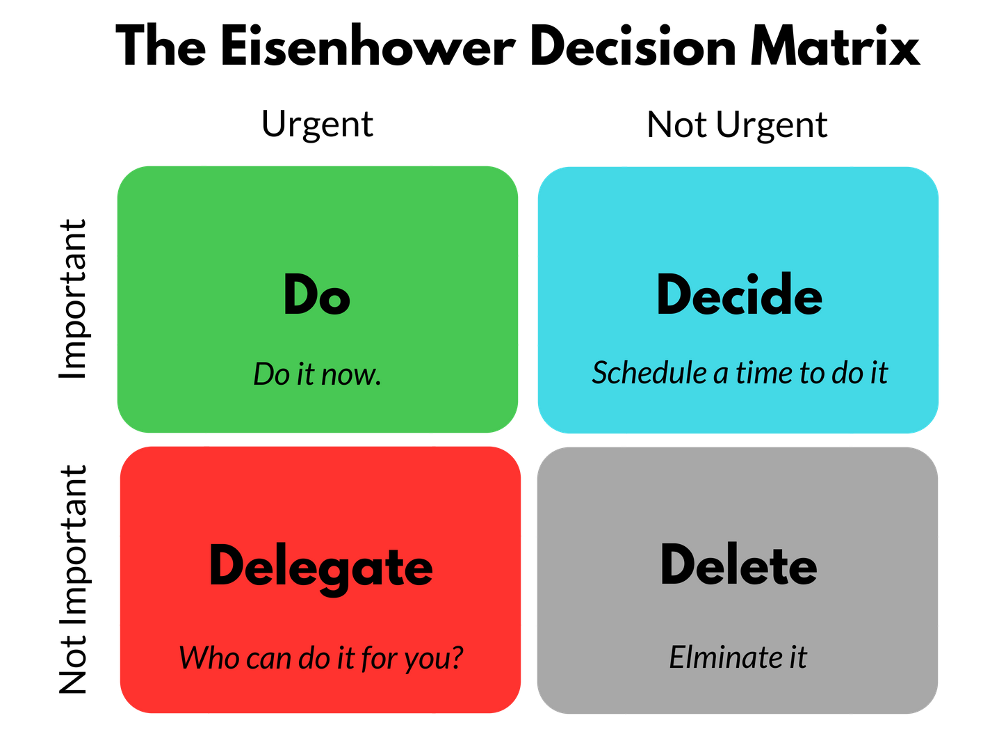

Setiap orang pasti pernah mengalami kelelahan setelah seharian bekerja. Namun sayang, munculnya rasa lelah ini tidak menjamin bahwa apa yang kamu kerjakan memberikan progres yang signifikan terhadap tujuanmu. Hal ini bisa terjadi karena beberapa alasan.

Salah satunya adalah kamu sibuk mengerjakan tugas-tugas yang tidak terlalu penting dan mendesak. Untuk menghindari hal ini, ada cara yang bisa kamu lakukan. Salah satunya adalah teknik MIT (_Most Important Tasks_).

Dari namanya _sih_ sudah ketahuan _kan_ apa maksud dari metode ini? Tapi, biar lebih paham, kita bakal _jelasin_ secara lebih mendalam buat kamu!

## **Apa itu MIT?**

Sederhananya, _most important tasks_ adalah tugas penting yang bila dikerjakan akan menciptakan hasil atau progres yang signifikan. Bahkan, jika kamu hanya melakukan satu tugas per hari, di akhir minggu kamu akan menyadari bahwa progresnya sudah banyak. MIT harus berupa aksi spesifik yang bisa membuatmu lebih dekat dengan sebuah _goals._

Perlu disadari bahwa tidak semua tugas dalam _[to-do list](https://docheck.id/pentingnya-to-do-list-untuk-manajemen-waktu/)_ kamu itu penting dan harus dikerjakan secepatnya. Menyelesaikan beberapa tugas kecil atau ‘kurang penting’ yang tidak mempunyai dampak signifikan terhadap _goals_, hanya akan membuatmu merasa belum mencapai apa-apa. Bahkan, ketika kamu sudah bekerja secara konsisten. Dengan mengidentifikasi mana tugas yang penting, kamu akan lebih mudah untuk fokus mengerjakannya.

Dikarenakan setiap orang mempunyai prioritas yang berbeda, jadi hanya kamu sendiri yang mengetahui mana tugas yang penting dan tidak. Namun, jika kamu masih bingung bagaimana cara mengetahui pentingnya sebuah tugas, kita punya beberapa tips yang akan membantu. Ini dia tipsnya!

## **_The Rule of 3_**

Mengutip [HourStack](https://hourstack.com/blog/most-important-task-strategy), Chris Bailey, penulis buku “_The Productivity Project_”, menyarankan untuk menggunakan _rule of 3_ untuk memikirkan apa yang perlu kamu fokuskan. Kamu perlu melakukan beberapa hal untuk bisa mengetahui tugas mana yang terpenting. Hal tersebut yaitu:

1. Tulis tiga hal yang ingin kamu capai atau selesaikan hari ini.
2. Tulis tiga hal yang ingin kamu capai atau selesaikan minggu ini.
3. Tuliskan tiga hal yang ingin kamu capai di tahun ini.

Menurutnya, penting untuk menuliskan hal-hal yang bersifat kecil dan besar seperti apa yang ingin dicapai selama setahun. Hal ini akan membuatmu mengetahui lebih jelas tujuan jangka panjang mengapa kamu mengerjakan tugas tersebut. Dengan begitu, pemahamanmu akan lebih baik tentang tugas mana yang dapat mendekatkanmu pada tujuan akhirnya.

Dalam MIT, kamu hanya perlu mengerjakan dan fokus pada satu dari tiga hal tersebut. Jangan lakukan hal lain sampai kamu benar-benar menyelesaikannya. Jika ada ide untuk mengerjakan tugas lain muncul selagi kamu mengerjakannya, tuliskan ide tersebut sebagai sebuah ‘gangguan’. Kamu bisa membuat sebuah daftar gangguan jika memang hal tersebut cukup banyak kamu temui.

## **Mengajukan Beberapa Pertanyaan pada Diri Sendiri**

_unsplash/@towfiqu999999_

Josh Kaufman menyarankan untuk bertanya pada diri sendiri untuk mencari tahu [prioritas tugas](https://personalmba.com/most-important-tasks/). Pertanyaan-pertanyaan seperti, “Apa dua atau tiga hal terpenting yang perlu aku lakukan hari ini?” atau, “Hal-hal apa saja yang jika aku selesaikan hari ini, akan membuat perbedaan progres besar?”. Kemudian, jika kamu sudah mengetahuinya, tulis tugas-tugas ini dalam sebuah _to-do list_. Cobalah untuk menyelesaikannya terlebih dahulu sebelum berpindah ke tugas dengan prioritas yang lebih rendah atau tidak lebih penting.

Menggabungkan teknik ini bersama dengan menentukan _deadline_ artifisial (bukan yang sebenarnya), akan jauh membuatnya lebih efektif, lanjut penulis buku “The Personal MBA” tersebut. Hal ini terjadi karena adanya _parkinson law_. Tenang, kita bakal jelasin kok apa itu _parkinson law_.

Sederhananya, _parkinson law_ adalah sebuah kaidah yang mengatakan bahwa, sebuah pekerjaan akan berkembang mengisi waktu yang tersedia untuk menyelesaikannya. Artinya, semakin lama waktu yang diberikan untuk menyelesaikan sebuah tugas atau pekerjaan, maka akan semakin lama juga selesainya.

**Baca Juga: [Mau Lancar Public Speaking? Pastikan Dulu To Do List Ini!](https://docheck.id/mau-lancar-public-speaking-pastikan-dulu-to-do-list-ini/)**

Jika sebuah pekerjaan harus diselesaikan dalam satu hari, maka pekerjaan tersebut akan selesai dalam satu hari. Jika sebuah pekerjaan harus diselesaikan dalam satu minggu, maka akan selesai satu minggu juga. Begitu seterusnya.

Oleh karenanya, menurut Kaufman, menggabungkan MIT dengan _deadline_ artifisial (dibuat oleh sendiri atau bukan _deadline_ sebenarnya) akan membuat tugas penting selesai lebih cepat.

## **Menggunakan _Eisenhower Matrix_**

Mengutip [laman resminya](https://www.eisenhower.me/eisenhower-matrix/), _eisenhower matrix_ jatau _urgent-important matrix_, dapat membantu kita untuk memutuskan dan memprioritaskan tugas berdasarkan urgensi dan kepentingan. Dalam matriks ini, terdapat empat kuadran dengan strategi kerja yang berbeda. Berikut adalah keempat kuadran tersebut:

1. **_Do_**: Tugas atau pekerjaan yang sifatnya mendesak dan penting. Kamu harus mengerjakannya terlebih dahulu dan fokus ke sini. Contohnya, membuat artikel yang harus _disubmit_ keesokan hari.
2. **_Schedule_**: Tugas atau pekerjaan yang tidak mendesak namun penting. Karena pekerjaan ini biasanya tidak ada _deadlinenya_, maka kamu harus menjadwalkan kapan untuk mengerjakannya. Contohnya, memulai kembali aktivitas berolahraga yang sudah lama direncanakan.
3. **_Delegate_**: Tugas atau pekerjaan yang mendesak namun tidak penting. Karena pekerjaan ini tidak penting bagimu (bisa dilakukan oleh orang lain), maka kamu bisa menyarankan atau menyuruh orang lain untuk melakukannya. Contohnya, ketika ada orang yang meminta bantuanmu untuk mengerjakan sesuatu, kamu bisa menyarankan orang lain untuk membantunya, karena kamu tahu orang tersebut akan lebih baik dalam mengerjakannya.
4. **_Delete or don’t do_**: Tugas atau pekerjaan tidak mendesak dan tidak penting. Tugas yang sebaiknya tidak kamu lakukan karena dapat mengganggu produktivitasmu. Contohnya, _scrolling timeline_ media sosial, membalas _chat_, dan sebagainya.

_Nah_, sekarang kamu sudah lebih paham _kan_ mengenai MIT? Untuk menentukannya, kamu bisa melakukan beberapa cara, dari menggunakan _the rule of 3_ hingga _eisenhower matrix_. Mengerjakan tugas terpenting dan paling mendesak akan membuat progres yang signifikan terhadap _goals_ kamu.

Ngomong-ngomong soal _goals_, kamu bisa menulisnya di aplikasi DoCheck, _loh_! Tidak hanya itu, kamu juga bisa sekalian membuat _to-do list_ untuk mewujudkannya. Tak lupa, ada juga rekomendasi-rekomendasi yang akan semakin memudahkanmu dalam merwujudkan _goals_ tersebut! Makanya, segera _[download](https://play.google.com/store/apps/details?id=com.docheck.docheck)_ DoCheck di Google Play Store. Gratis!

Semoga dengan mengethaui MIT, kamu bisa [lebih produktif](https://docheck.id/meningkatkan-produktivitas-di-tahun-baru-cek-to-do-list-ini/) dan segera bisa mewujudkan _goals_ kamu.
