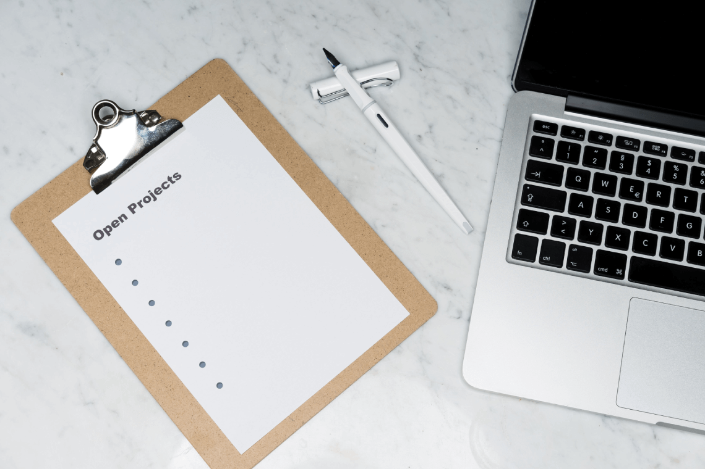

Kamu pasti pernah mendengar kata _planning fallacy_ bukan? Apa itu _planning fallacy_? Kamu pernah bertanya-tanya gak, mengapa kita sering salah dalam memperkirakan selesainya sebuah tugas? Nah, fenomena ini dinamakan dengan _planning fallacy_.

Begini penjelasannya. Misal di hari Senin, seorang siswa di sebuah sekolah mendapatkan tugas esai, yang harus dikumpulkan Jumat. Sebelumnya, ia pernah mendapatkan beberapa tugas serupa.Tugas-tugas serupa sebelumnya, membutuhkan 3 hari untuk ia selesaikan. Ia menyimpulkan bahwa tugas yang ia dapatkan hari ini di sekolah bisa diselesaikan juga dalam 3 hari. Sampai hari Rabu, ia tidak mengerjakan tugasnya. Ternyata, perkiraannya meleset sehingga telat mengumpulkannya.

## Apa itu Planning Fallacy?

_unsplash/@martenbjork_

Mengutip _The Decision Lab_, istilah _planning fallacy_ pertama kali dikenalkan oleh Daniel Kahneman dan Amos Tversky, dua orang figur yang cukup terkenal pada bidang ekonomi perilaku. _Planning fallacy_ adalah kekeliruan berpikir yang membuat seseorang atau kelompok memiliki kecenderungan untuk meremehkan biaya, waktu, dan hambatan dari sebuah rencana.

Menurut mereka, ketika membuat prediksi tentang masa depan, orang cenderung mengandalkan sebagian besar pada penilaian intuitif yang tidak akurat. Kesalahan yang dibuat bersifat tidak acak, menunjukkan bahwa hal tersebut dihasilkan dari bias kognitif yang seragam. Nah, bias inilah yang kemudian menjadi penyebab _planning fallacy_.

## Mengapa Planning Fallacy Bisa Terjadi?

_Optimism bias_, salah satu bias kognitif yang menjadi penyebab utama dari _planning fallacy_. _Optimism bias_ adalah kecenderungan untuk memikirkan kemungkinan positif dan meremehkan kemungkinan seseorang mengalami peristiwa negatif. _Wishful thinking_ juga bisa menjadi penyebab utama yang lain. Seseorang memiliki kecenderungan membayangkan untuk menyelesaikan sesuatu secepat dan seefisien mungkin.

Hal inilah yang kemudian membuat seseorang terlalu optimis dalam memprediksi sesuatu. Mengabaikan informasi-informasi yang berlawanan dengan pemikiran optimistik tadi. Termasuk hambatan-hambatan yang mungkin terjadi dalam mengerjakan proyek atau sesuatu tersebut.

Seperti kasus siswa tadi, ia optimis bahwa bisa mengerjakan tugas esai dalam 3 hari. Namun, ternyata selama ia mengerjakan, berbagai macam hambatan yang muncul, misalnya seperti terjadi pemadaman listrik, esai yang dikerjakan sekarang ternyata lebih sulit dari yang sebelumnya, dan lain sebagainya. Sehingga, ini menyebabkan rencana awalnya meleset dan berakhir telat mengumpulkan tugas.

_Planning fallacy_ adalah sesuatu yang buruk, karena dapat memunculkan berbagai macam masalah. Salah satu _planning fallacy_ yang paling terkenal adalah pembuatan Opera House di Australia. Bangunan ikonik tersebut awalnya direncanakan selesai dalam 4 tahun dan membutuhkan dana sekitar AUS $7 juta. Namun, pada akhirnya membutuhkan waktu 14 tahun dan dana sebesar AUS $102 juta untuk selesai.

Dalam kasus Opera House, masalah yang muncul karena _planning fallacy_ adalah pendanaan. Tapi tenang, ada dua cara yang bisa kamu lakukan kok untuk menghindari hal ini. Yuk, simak cara-caranya!

### Mengacu pada Tugas atau Project Sebelumnya

_unsplash/@markuswinkler_

Profesor Grushka-Cockayne dari [Darden School of Business](https://prolifiko.com/the-planning-fallacy-why-you-miss-your-deadlines-and-how-you-can-stop/), University of Virginia, mengatakan bahwa menjadikan tugas atau _project_ serupa di masa lalu bisa membantu dalam mengatasi _planning fallacy_. Hal ini kamu jadikan sebagai data untuk merencanakan tugas atau _project_ yang akan kamu kerjakan. Namun, ini adalah data internal, yang berasal dari diri kamu sendiri. Kamu perlu untuk mengambil persepsi lain guna mendapatkan data eksternal.

Pada kasus siswa telat mengumpulkan esai tadi, ia telah mengacu pada pengalaman masa lalu. Tapi, ia gagal untuk mengambil cara pandang lain. Hal ini membuatnya jadi tidak mempertimbangkan faktor atau gangguan eksternal yang akan muncul.

Ia seharusnya bisa mencari tahu dulu mengenai topik dari tugas esai yang diberikan. Jika sudah mencari tahu dan mempunyai gambaran seberapa susah topik tersebut untuk diangkat menjadi esai, maka perencanaan pun bisa lebih sempurna.

## Murphy’s Law

_unsplash/@giamboscaro_

_If anything can go wrong, it will._ Sesuatu yang bisa salah, maka akan salah. Hukum ini, dapat membantu kita untuk mengharapkan sesuatu yang tidak terduga.

Itu adalah inti dari hukum ini, yang dinamai berdasarkan seorang _aerospace engineer_ Amerika Serikat bernama Edward Aloysius Murphy Jr. Pekerjaannya banyak melibatkan pengujian, desain, dan eksperimental. Wajar jika ia sering dihadapkan pada hal-hal yang tidak sesuai dengan rencana. Oleh karena itu, hukumnya berbicara mengenai sesuatu yang tidak terduga itu sangat bisa terjadi.

Semenjak pertama kali dicetuskan, hukum ini sudah banyak berkembang dan sekarang mencakup berbagai bidang berikut ini:

**_Project planning_:** Jika sesuatu bisa salah, maka kesalahan tersebut akan terjadi.

**_Performance management_:** Jika seseorang bisa salah, maka ia akan melakukannya.

**_Risk assessment_:** Jika beberapa hal bisa salah, maka hal yang paling tidak kamu harapkan tidak terjadi, maka akan terjadi.

**_Practical creativity_:** Jika kamu memikirkan tentang 4 kesalahan atau hambatan, maka 5 kesalahan atau hambatan akan muncul.

Murphy’s law akan membuat orang berpikir secara pesimis. Ini akan menyeimbangkan kecenderungan optimistik seseorang. Maka, kamu bisa menghindari _planning fallacy_ dengan ini.

Nah, jadi intinya, _planning fallacy_ itu disebabkan oleh kecenderungan cara berpikir seseorang yang optimistik. Sehingga pada akhirnya melupakan hal-hal negatif atau hambatan yang mungkin terjadi saat mengerjakan sesuatu. _Murphy’s law_ dan mengacu pada tugas atau _project_ sebelumnya bisa membantu kamu terhindar darinya.

Ngomong-ngomong soal _planning_ atau perencanaan, kamu bisa banget loh bikin _planning_ dengan aplikasi DoCheck! Kamu tinggal bikin _goals_ di sana, dan membuat _[to-do list](https://docheck.id/pentingnya-to-do-list-untuk-manajemen-waktu/)\-nya_ untuk mewujudkan _goals_ tersebut! Makanya, yuk segera _download_ DoCheck sekarang di [App Store](https://apps.apple.com/id/app/docheck-to-do-list-app/id1603424606?l=id) dan [Google Play Store](https://play.google.com/store/apps/details?id=com.docheck.docheck). Gratis!

Sekian dari DoCheck mengenai _planning fallacy._ Semoga dengan mengetahui ini, kamu bisa lebih baik dalam merencanakan sesuatu. Dengan begitu, kejadian seperti telat mengumpulkan tugas tidak akan terjadi lagi, deh!
