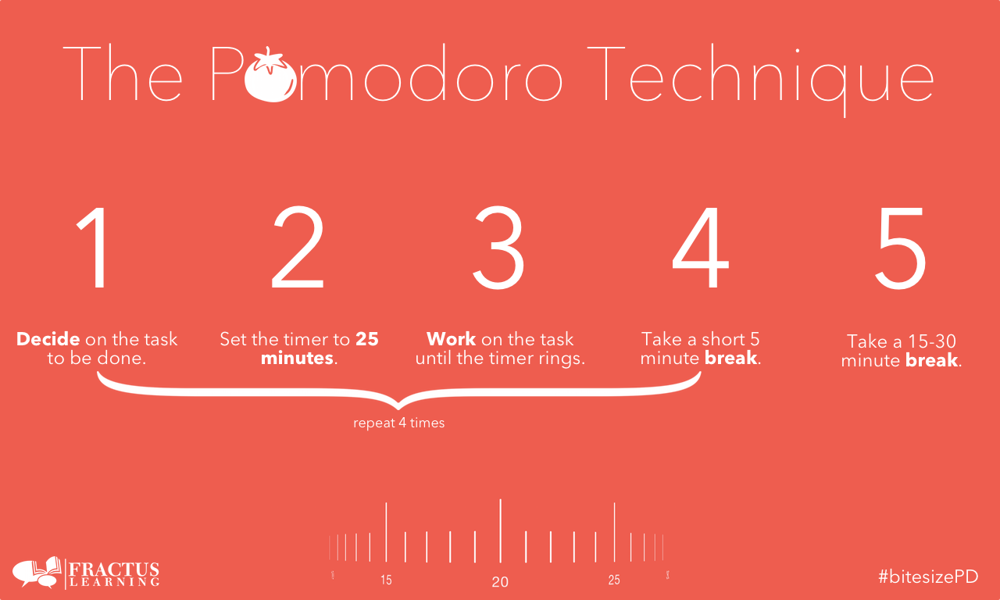

Baru juga mulai _ngerjain_ sesuatu, ada _notif_ _direct message_ Twitter masuk. Niat awalnya ingin fokus mengerjakan sesuatu, berujung _scrolling timeline_ selama satu jam. Kamu pernah mengalami hal semacam ini? JIka iya, kita bakal kasih sebuah cara untuk kamu agar bisa fokus mengerjakan sesuatu dan lebih produktif!

Sebenarnya, ada banyak cara untuk [meningkatkan produktivitas](https://docheck.id/meningkatkan-produktivitas-di-tahun-baru-cek-to-do-list-ini/). Seseorang dapat dikatakan lebih produktif ketika ia dapat menyelesaikan lebih banyak pekerjaan dalam waktu yang lebih sedikit dari biasanya. Salah satu yang bisa membantu meningkatkannya adalah teknik pomodoro.

Kamu pernah dengar teknik ini sebelumnya? Ternyata, teknik ini cukup populer, _loh._ Jika kamu belum pernah mendengarnya, _nih_ kita kasih tahu buat kamu. Baca sampai selesai, ya!

## **Apa itu Pomodoro?**

Pomodoro adalah sebuah metode atau teknik manajemen waktu yang dicetuskan oleh orang Italia bernama Francesco Cirillo. Ia adalah pemilik dari firma konsultan yang berbasis di Berlin, Jerman. Ia membuat pomodoro dengan tujuan untuk mengerjakan sesuatu lebih banyak dengan waktu yang lebih sedikit.

Pada saat menjadi mahasiswa di akhir tahuan 1980, Cirillo sangat berjuang untuk memfokuskan dirinya dalam belajar dan mengerjakan tugas. Merasa kewalahan, ia kemudian berkomitmen hanya selama 10 menit untuk fokus belajar.

Terdorong dengan komitmen tersebut, ia kemudian menemukan pengatur waktu dapur berbentuk tomat untuk menghitung waktu fokusnya. Terlahirlah metode pomodoro yang dinamakan sesuai dengan bentuk pengatur waktu yang ia temukan pada saat itu (pomodoro dalam Bahasa Italia berarti tomat).

**Baca Juga: [The Commitment Inventory: Manajemen Waktu untuk Produktif](https://docheck.id/the-commitment-inventory-manajemen-waktu-untuk-produktif/)**

Ketika kita menggunakan metode ini, kita diharuskan untuk membagi waktu kerja menjadi blok atau potongan selama 25 menit yang disebut sebagai pomodoro. Setiap pomodoro tersebut dipisahkan oleh waktu istirahat selama 5 menit. Setelah 4 pomodoro, kamu mendapatkan waktu istirahat yang lebih lama, yaitu 15 hingga 20 menit.

Langkah 1 – 4 adalah apa yang yang disebut sebagai satu blok pomodoro. Foto dari [Fractus Learning](https://www.fractuslearning.com/tomato-students-stay-on-task/)

Pomodoro sangat populer. Mengutip _[website](https://francescocirillo.com/)_ Francesco Cirillo, saat ini, metode pomodoro sudah digunakan oleh lebih dari 2 juta orang. Lalu, apa _sih_ kira-kira yang membuat metode ini begitu berguna?

Jawaban sederhananya adalah metode ini dianggap efektif untuk membantu orang menyelesaikan sesuatu.

## Membuat Kamu Lebih Mudah untuk Mulai Melakukan Sesuatu

Sering kali yang menjadi salah satu penghalang terbesar kita untuk sukses adalah susah untuk memulai sesuatu, menurut penelitian yang dilakukan oleh Kenneth McGraw dan koleganya. Pomodoro dapat membantu kamu untuk memulai sesuatu. Hal tersebut terjadi karena pomodoro memungkinkan kamu untuk memecah pekerjaan yang kompleks menjadi beberapa pekerjaan kecil yang sederhana.

Mengutip [NBC](https://www.nbcnews.com/id/wbna55503417), menurut John Bargh, seorang profesor psikologi dari Yale University, saat kita memulai sebuah pekerjaan yang besar, pikiran kita akan mencoba untuk menstimulasikan pekerjaan yang benar-benar produktif dengan berfokus pada tugas-tugas kecil dan tidak penting untuk menghabiskan waktu.

Oleh karenanya, dengan memecah pekerjaan besar menjadi beberapa pekerjaan kecil yang sederhana akan membantu kamu memulai bekerja. Misalnya, alih-alih duduk untuk menulis artikel secara keseluruhan, tulislah pembukaannya dulu selama 5 menit. Melakukan sesuatu yang kecil dalam waktu singkat jauh lebih mudah daripada langsung mengerjakan pekerjaan besar sekaligus.

**Baca Juga: [5 Cara Menjadi Pribadi Produktif, Yuk Berubah!](https://docheck.id/cara-menjadi-produktif/)**

## Dapat Memerangi Distraksi

Notifikasi email masuk, _chat_, media sosial, sering kali mengganggu fokus kita. Ketika kita sudah terdistraksi oleh hal-hal tersebut, akan sangat sulit untuk kembali fokus. Dengan ini, apakah berarti kita dapat menyalahkan teknologi karena membuat kita tidak fokus?

Ternyata, sebuah [penelitian](https://www.ics.uci.edu/~gmark/Home_page/Publications_files/CHI%202018%20Workplace%20Distractions.pdf?forcedefault=true) mengungkapkan, lebih dari setengah gangguan di hari kerja, disebabkan oleh diri kita sendiri. Maksudnya adalah, kita menarik diri dari fokus. Misalnya seperti, “Buka Twitter dulu _deh_ 5 menit”, atau, “Balas _chat_ teman dulu _ah_, paling juga _gak_ makan waktu sampai 5 menit”, dan sebagainya. Kamu pasti pernah seperti ini, _kan_?

Jika kamu adalah salah satu dari banyaknya orang yang sering seperti itu, pomodoro mungkin bisa membantu kamu terhindar dari distraksi semacam ini. Lalu, bagaimana sih melakukan metode pomodoro? Gampang, _kok_!

## **Contoh Penggunaan Metode Pomodoro pada Saat Menulis Sebuah Artikel**

_unsplash/@thoughtcatalog_

Berikut ini beberapa langkah yang harus kamu lakukan untuk menggunakan metode pomodoro saat mengerjakan sesuatu:

**Pertama**: Tentukan tugas yang ingin kamu kerjakan. Contoh, menulis paragraf pembuka.

Dalam metode pomodoro kamu diharuskan untuk memecah tugas besar menjadi beberapa tugas kecil. Misalnya, alih-alih menulis keseluruhan artikel secara langsung, tulislah kalimat pembukanya dulu selama pomodoro (interval waktu pengerjaan 25 menit) pertama.

**Baca Juga: [Lingkungan Kerja Produktif untuk Hidup yang Lebih Baik](https://docheck.id/lingkungan-kerja-produktif-hidup-lebih-baik/)**

**Kedua**: Setel pengatur waktu selama 25 menit.

Jika dirasa waktu 25 menit terlalu lama atau sebentar, kamu bisa sesuaikan waktunya.

**Ketiga**: Kerjakan tugas yang sudah ditentukan, dalam konteks ini berarti menulis paragraf pembuka hingga waktu habis (25 menit atau satu pomodoro).

**Keempat**: Setelah waktu habis, istirahatlah selama 5 menit.

**Kelima:** Setiap 4 pomodoro (25 menit), kamu diharuskan untuk istirahat lebih lama, yaitu 15 menit.

Jika paragraf pembuka sudah selesai, kamu bisa menentukan tugas selanjutnya. Misalnya, membuat paragraf pembahasan. Ulangi langkah-langkah ini hingga kamu menyelesaikan satu artikel secara utuh.

Kurang lebih seperti itu cara untuk menerapkan metode pomodoro pada saat mengerjakan sesuatu. Dengan menggunakan metode ini, kamu akan lebih mudah untuk memulai mengerjakan sesuatu dan bisa menghindarkanmu dari distraksi ketika mengerjakannya. Kamu bisa memecah pekerjaan besar menjadi beberapa pekerjaan kecil kemudian mencatatnya sebagai _to-do list_.

Jangan lupa, bikin _to-do list_\-nya pakai aplikasi DoCheck, ya! Lewat aplikasi DoCheck, kamu bisa mencentang tugas-tugas yang sudah selesai, sehingga akan memudahkanmu memantau progres pengerjaan sudah sejauh mana. Yuk, segera _[download](https://play.google.com/store/apps/details?id=com.docheck.docheck)_ aplikasi DoCheck di Google Play Store sekarang. Gratis!

**Baca Juga: [Gagal Produktif, Kok Bisa Sih? Yuk Intip Alasannya!](https://docheck.id/gagal-produktif/)**

Sekian dari DoCheck mengenai metode pomodoro. Semoga dengan mengetahui metode ini, kamu bisa semakin produktif, ya! Yuk, segera terapkan metode ini!
