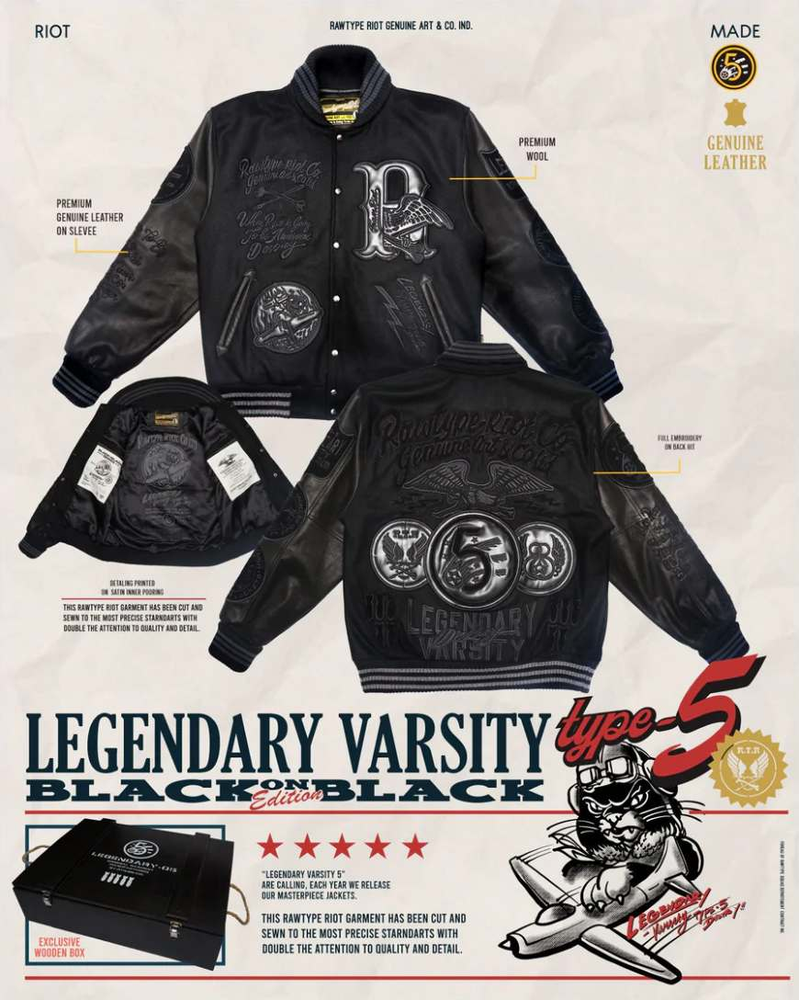
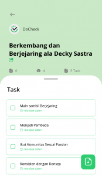

Ketika berbicara mengenai _brand fashion_ dengan kualitas tinggi, mungkin yang menjadi _top of mind_ kamu adalah _brand_ yang berasal dari luar negeri. Nampaknya, anggapan ini sudah mulai bergeser. Belakangan, _high quality fashion brand_ dari Indonesia mulai bermunculan. Salah satu diantaranya adalah Rawtype Riot.

_Brand fashion_ asal Bandung tersebut mengusung tema _genuine_ _art & co._ Sesuai namanya, desain produk-produknya sengaja dibuat kasar (_raw_) dan “berantakan”. Rawtype Riot didirikan pada 2017, produk-produknya banyak terinspirasi _vintage American style, Japanese style_, dan budaya khas Indonesia. Tidak heran, mengingat _founder_ dibaliknya, Decky Sastra, dikenal sebagai penggiat barang-barang _vintage_ dan otomotif.

Membangun bisnis bagi pria kelahiran Jakarta, 5 Mei 1988 tersebut bukanlah hal yang mudah. Sebelum mendirikan Rawtype Riot, dahulu Decky Sastra harus banyak membantu keuangan orang tuanya. Dari mulai membantu sang Ibu berjualan pakaian muslim hingga menjadi desainer ia tekuni agar bisa melanjutkan pendidikan.

Kini, Rawtype Riot telah meraih popularitasnya sebagai _brand_ lokal yang berkualitas. Rawtype Riot pernah memenangkan Kumparan _[Local Brand Editor’s Choice](https://kumparan.com/millennial/pemenang-local-brand-editors-choice-kategori-merek-paling-viral-rawtype-riot-1uTcniTyW0K)_ kategori merek paling viral, ikut meramaikan Mooneyes (salah satu festival mobil dan motor _custom_ terbesar di dunia), hingga berkolaborasi dengan duo DJ asal Belanda – Yellow Claw. Bahkan, gubernur Jawa Barat, Ridwan Kamil, dan presiden Joko Widodo, pernah terlihat mengenakan Rawtype Riot, _loh_!

## **Faktor Sukses Rawtype Riot**

Lalu, apa _sih_ yang membuat Rawtype Riot sebesar sekarang? Decky Sastra menjawab, kalau hal tersebut tidak lepas dari peran _networking_ yang menurutnya bisa membuat kamu berkembang.

### **Main Sambil Berjejaring**

Decky Sastra punya prinsip, “_Ketika bermain, saya ingin menyebarkan sifat positif dan kebaikan saya kepada orang lain_”. Menurutnya, dengan “bermain”, ia berkesempatan untuk memperluas sudut pandang dan menciptakan lingkungan suportif secara organik.

“Bermain” dengan cara mengikuti ekshibisi, komunitas, ataupun pameran akan membuka peluang untuk mendapatkan teman-teman yang memiliki ketertarikan sama. Merekalah yang kemudian menurut Decky sangat membantu dalam membangun Rawtype Riot. Bahkan, berkat relasinya tersebut, pada 2017, salah satu teman komunitasnya mengabarkan kepadanya, bahwa secara pribadi ia diundang ke Istana Negara sebagai perwakilan _etrepreneur_ asal Bandung dalam rangka memperingati Hari Sumpah Pemuda.

**Baca Juga: [Peran Networking dalam Kesuksesan Rawtype Riot](https://docheck.id/peran-networking-dalam-kesuksesan-rawtype-riot/)**

### **Rawtype Riot Menjadi Pembeda**

_source: rawtyperiot.co_

Membangun bisnis idealnya memang mengikuti pasar atau tren agar produknya laku. Namun, yang harus diingat adalah saat terjun mengikuti tren atau pasar, bisnis yang dibangun tak jarang harus berhadapan dengan para pemain lama. Bagaimana jika kamu membangun pasar atau tren sendiri?

Jika kamu berhasil melakukannya, maka bisnismu akan menjadi satu-satunya pemain di tren atau pasar baru yang kamu ciptakan tersebut. Hal ini, persis seperti apa yang dilakukan Rawtype Riot dengan cara menyediakan produk unik yang _limited edition_. Keputusannya ini sempat membuat beberapa orang kebingungan karena biasanya konsep tersebut hanya dilakukan oleh _brand-brand_ luar negeri.

Dengan apa yang telah dicapainya sekarang, Decky berhasil membuktikan kalau tren bisa diciptakan dan pasar bisa dibangun.

### **Ikut Komunitas Sesuai _Passion_**

Ruang dan waktu selalu menjadi _barrier_ dalam berinteraksi. Namun, itu hanya berlaku sebelum kemunculan internet dan media sosial. Sekarang, kamu dapat terhubung kapan pun dengan orang yang berada di belahan bumi mana pun berkat internet dan media sosial.

Manfaatkanlah media sosial untuk memperluas “koneksi”. Ada sebuah cara yang menurut Decky cukup ampuh dalam memperluas koneksi untuk perkembangan bisnis kamu, yaitu dengan terjun ke komunitas. Dengan melakukannya, maka kamu akan memahami produk seperti apa _sih_ yang dibutuhkan oleh mereka? Selain itu, komunitas juga bisa berdampak baik pada kreativitas dan semangatmu dalam menjalani bisnis.

**Baca Juga: [Fase Pengembangan Bisnis ala Rawtype Riot](https://docheck.id/fase-pengembangan-bisnis-ala-rawtype-riot/)**

### **Konsisten dengan Konsep**

Konsisten. Mungkin, yang satu ini cukup klise namun, berpegang teguh dengan konsep yang diciptakan dan sudah dibawa sejak awal itu cukup penting. Kamu juga harus sabar dan konsisten dalam penerapannya, bagaimanapun situasi dan kondisi yang nanti akan dihadapi.

Pada awalnya, Decky hanya berniat menjual produk Rawtype Riot sebagai _merchandise_ sebuah acara. Namun, tidak disangka, produknya cepat ludes terjual dan permintaan konsumen terus meningkat. Sehingga, Decky memutuskan untuk lanjut memproduksinya, walaupun modalnya pas-pasan.

Di edisi kedua, kejadian tersebut terulang. Pada saat itu Decky belum mengambil keuntungan dari penjualan tersebut. Walaupun begitu, ia tetap melakukan perkembangan agar karya-karyanya lebih banyak disukai orang. Modal yang minim bukanlah sebuah halangan kalau kamu punya ide dan konsep yang menawan!

_Networking_ sepenting itu bagi Decky Sastra. Tanpa _networking_, mungkin Rawtype Riot tidak akan sebesar sekarang. _Nah_, kamu bisa mendapatkan kiat-kiat untuk berkembang dan berjejaring ala Decky Sastra ini di aplikasi DoCheck dalam bentuk _predefined goal_.

_Predefined goal_ berkembang dan berjejaring ala Decky Sastra.

**Baca Juga: [Goals Recommendation: Bisa Bantu Capai Life Goals!](https://docheck.id/goals-recommendation-bisa-bantu-capai-life-goals/)**

Yuk, yang ingin mengikuti jejak kesuksesan Decky Sastra, segera _download_ aplikasi DoCheck di [App Store](https://apps.apple.com/id/app/docheck-to-do-list-app/id1603424606?l=id) dan [Google Play Store](https://play.google.com/store/apps/details?id=com.docheck.docheck) sekarang. Gratis!
