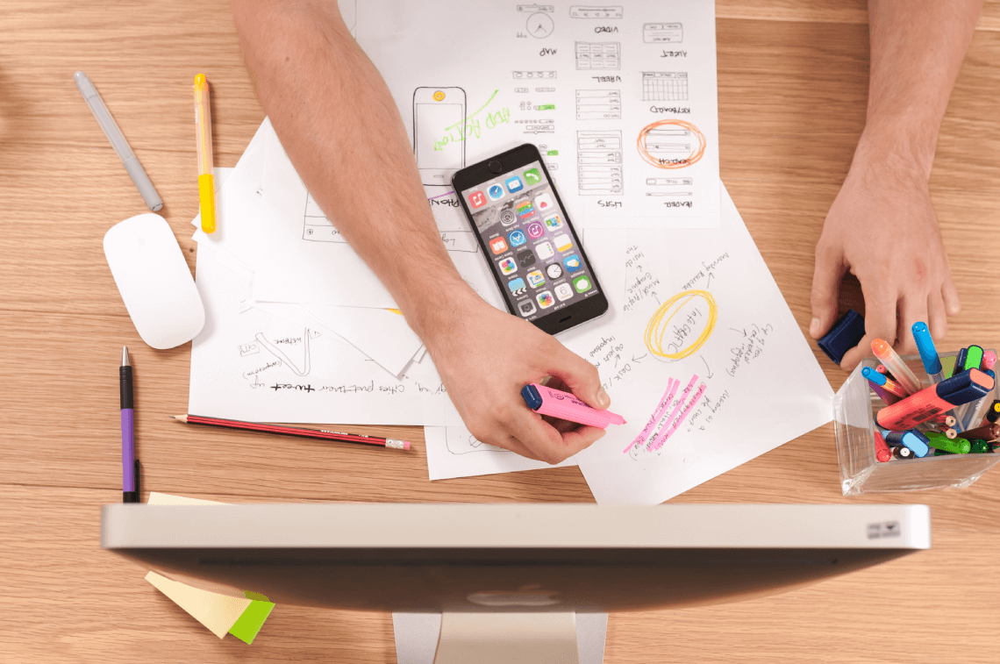

Self reflection adalah kemampuan untuk mengevaluasi perasaan atau tindakan diri sendiri. Kita semua pasti mempunyai pengalaman di masa lalu. Sebagai bagian dari masa lalu, wajar jika kadang kita mengingatnya. Namun, jika pengalaman tersebut merupakan hal yang buruk, mungkin kita akan mengingatnya sebagai sesuatu yang buruk juga.

Saat memikirkan kesalahan di masa lalu, kerap kali kita menyesalinya dan berharap bisa merubahnya. Tapi, sampai sekarang mesin waktu belum terbukti keberadannya. Jadi, kamu _gak_ bisa _nih_ balik ke masa lalu untuk memperbaikinya. Lebih repot lagi kalau kamu masih _aja_ melakukan kesalahan tersebut berulang-ulang. Kayaknya, kamu perlu melakukan _self reflection_ deh agar terhindar dari kejadian seperti ini. _Nah_, udah pada tahu belum tentang _self reflection_?

## Apa itu _Self Reflection_

_unsplash/@carolineveronez_

Menurut [_American Psychology Association Dictionary of Psychology_](https://dictionary.apa.org/self-reflection), refleksi diri atau _self reflection_ adalah sebuah kemampuan untuk mengevaluasi, merenungkan, dan menganalisis pikiran, perasaan, maupun tindakan dari diri sendiri. Evaluasi semacam ini memungkinkan kita untuk melihat hal-hal penting dari setiap keadaan atau kondisi yang sudah pernah terjadi sebelumnya. Dengan begitu, secara tidak langsung hal ini dapat membuat kita lebih mengenal diri sendiri.

_Self_ _reflection_ memungkinkan kita untuk mengevaluasi hidup secara keseluruhan. Apakah sudah sesuai dengan tujuan? Apakah kita senang dengan arahnya? Kita juga dapat membuat penyesuaian jika memang diperlukan. Lebih jauh, kita akan tahu hal-hal apa saja yang dapat berjalan dan tidak berhasil sehingga kita bisa terhindar dari kesalahan-kesalahan yang pernah kita lakukan di masa lalu.

Tentu, pada saat melakukan refleksi diri, kita melibatkan pikiran. Hal ini membuat kita kadang sulit membedakan antara _self_ _reflection_ dengan _overthinking_. Padahal, keduanya sangat berbeda sekali, _loh_!

_[Overthinking](https://docheck.id/overthinking-apa-dan-penyebabnya/)_ sendiri adalah pemikiran berlebih dan berulang mengenai sesuatu yang sudah atau bahkan belum terjadi. Kalau kamu memikirkan masa lalu tersebut secara berlebihan tanpa menghasilkan sebuah solusi untuk apa yang sedang kamu pikirkan, berarti kamu lagi _overthinking_. Tapi, kalau dari pemikiranmu itu menghasilkan sebuah solusi, berarti itu termasuk _self_ _reflection._

Mempertanyakan segala sesuatu dalam konteks yang positif adalah inti dari _self_ _reflection_. Jika _overthinking_ akan berdampak buruk bagi kesehatan mentalmu, maka _self reflection_ ini sebaliknya, _loh_!

**Baca Juga: [Self-reflection: Cara untuk Bersyukur dan Mengenal Diri](https://docheck.id/self-reflection-cara-untuk-bersyukur-dan-mengenal-diri/)**

## Manfaat _Self Reflection_

Sebuah [penelitian](https://link.springer.com/content/pdf/10.1007/s10459-011-9298-z.pdf) menemukan bahwa, siswa yang melakukan refleksi diri tentang bagaimana dan apa saja yang telah dipelajari, akan membantu meningkatkan kemampuan akademisnya. Terus kalau kamu bukan siswa, berarti _self_ _reflection gak_ bermanfaat _dong_? Jangan salah, ternyata _self_ _reflection_ punya berbagai macam manfaat!

Penasaran kan manfaatnya apa saja? Tenang, kita bakal _jelasin_. Baca sampai selesai, ya!

### 1\. _Self Reflection_ Dapat Memberikan Kita Sebuah Perspektif

Pernah dengar pepatah, “Jangan mengambil sebuah keputusan ketika sedang marah”? Hal itu ada benarnya, karena emosi dapat mengaburkan penilaian kita akan sesuatu. Beberapa hal akan terlihat lebih rumit daripada yang sebenarnya.

_Self_ _reflection_ memungkinkan kita ‘berhenti’ sejenak untuk menilai mana yang penting dan tidak. Menurut sebuah [studi](https://www.researchgate.net/publication/317402616_%27I_Think_You_Think%27_Understanding_the_Importance_of_Self-Reflection_to_the_Taking_of_Another_Person%27s_Perspective), _self_ _reflection_ memungkinkan kita untuk melihat sesuatu dari persepktif orang lain. Dengan begitu, keputusan yang kita ambil akan lebih baik karena tidak hanya melibatkan perspektif diri sendiri.

**Baca Juga: [Buku Self-improvement: Bacaan Untuk Motivasi Diri](https://docheck.id/buku-self-improvement-bacaan-untuk-motivasi-diri/)**

### 2\. Membantu Kita Merespon, Bukan Beraksi

Perlu diingat bahwa respon dan reaksi adalah dua hal yang berbeda. Mengutip _[Psychology Today](https://www.psychologytoday.com/us/blog/focus-forgiveness/201609/react-vs-respond)_, reaksi didorong oleh keyakinan, bias, dan prasangka alam bawah sadar. Bertindak tanpa berpikir adalah salah satu contoh tindakan yang disebabkan oleh alam bawah sadar.

Melalui _self_ _reflection_, kita dapat merenungkan sebuah situasi. Alhasil, kita dapat merespon suatu keadaan dengan lebih bijaksana karena tidak ada keterlibatan alam bawah sadar.

Kalau kamu mau mengambil keputusan yang penting, misalnya seperti menentukan jurusan kuliah, jangan tergesa-gesa untuk memutuskannya, ya! Sediakan waktu untuk memikirkan hal ini, agar kedepannya kamu tidak menyesal.

### 3\. Membuat Kita Belajar dan Memahami Sesuatu

_unsplash/@firmbee_

Kadang, kita sering merasa lelah menjalani hidup. Bisa jadi hal ini terjadi karena kita lupa untuk ‘berhenti’ untuk berpikir dan merenungkannnya. Kita hidup tanpa memaknai kehidupan itu sendiri.

Dengan _self reflcetion_, kita dapat mengatasi masalah seperti ini. Mengevaluasi dan merenungkan apa saja yang sudah kita lalui memungkinkan kita untuk belajar darinya. Proses belajar ini yang kemudian menyadarkan kita apa arti kehidupan.

Sebuah [studi](https://onlinelibrary.wiley.com/doi/abs/10.1046/j.1365-2648.2001.01908.x) menunjukkan bahwa _self reflection_ membantu kita untuk bersikap lebih bijaksana. Kalau kata orang bijak, “Apapun yang terjadi, baik atau buruk, pasti ada hikmahnya”. Jadi, memang sudah seharusnya kita mengambil pelajaran dari apa yang sudah terjadi.

Ternyata, _self reflection_ itu penting, ya? Tindakan tersebut tidak hanya bisa membuat kita terhindar dari kesalahan berulang, tetapi juga membuat kita lebih mengenal diri sendiri. Dengan begitu, kamu bisa tahu apa tujuan hidupmu dan bagaimana cara mencapainya, _deh._

**Baca Juga: [5 Kesalahan Karyawan Baru yang Perlu Dihindari](https://docheck.id/kesalahan-karyawan-baru/)**

Ngomong-ngomong soal tujuan hidup, kamu bisa mulai tulis _goals_ kamu di aplikasi DoCheck! _Gak_ sampai situ, DoCheck juga akan memberikan berbagai macam _tips_ yang akan memudahkanmu untuk mencapai _goals_ tersebut. Tunggu apalagi? Segera [_download_](https://play.google.com/store/apps/details?id=com.docheck.docheck) aplikasi DoCheck di Google Play Store. Gratis!
