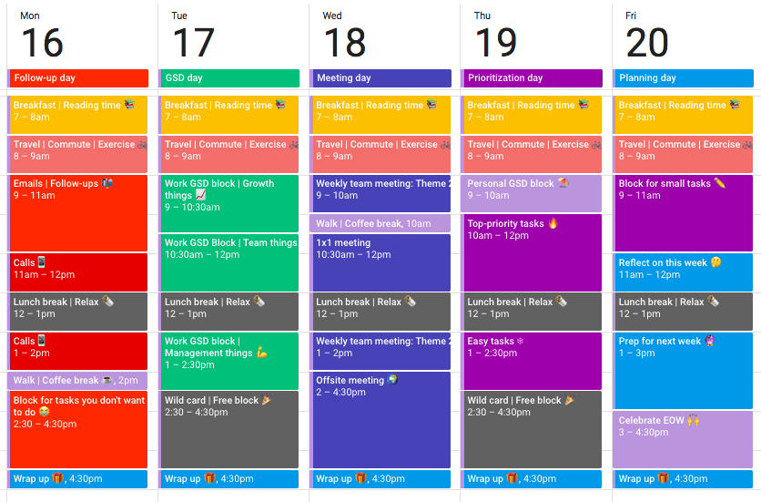

_To-do list_ adalah salah satu cara untuk menjadi lebih produktif. Namun, bagi sebagian orang, _to-do list_ saja tidak cukup untuk mewujudkan itu. Masalahnya adalah, ketika kamu membuat _to-do list_ untuk 8 jam kerja, sering kali berakhir hanya dengan produktif 1-2 jam kerja, _kan_?  
Tapi tenang, _To-do list_ bukanlah satu-satunya teknik manajemen waktu yang bisa membuatmu lebih produktif. Ada teknik lain yang membawa _to-do list_ ke level selanjutnya. Teknik tersebut dinamakan _time blocking_.

Figur-figur terkenal seperti [Elon Musk, Bill Gates, hingga penulis buku _Deep Work_ – Cal Newport, menggunakan teknik ini](https://blog.rescuetime.com/time-blocking-101/). Sekarang pertanyaannya adalah, apa itu _time blocking_?

**Baca Juga: [Pentingnya To-Do-List Untuk Manajemen Waktu](https://docheck.id/pentingnya-to-do-list-untuk-manajemen-waktu/)**

## Apa Itu _Time Blocking_?

_Time blocking_ adalah sebuah teknik manajemen waktu yang mengharuskan kamu untuk membagi hari menjadi blok-blok waktu. Pada setiap blok waktunya, kamu diharuskan untuk mengerjakan tugas spesifik atau sekumpulan tugas hingga selesai. Dengan time blocking, kamu jadi bisa melakukan sesuatu yang tepat di waktu yang tepat.

Dalam _time blocking_, memprioritaskan tugas adalah kunci. _Review_ mingguan adalah sebuah keharusan. Catat apa yang harus kamu lakukan di minggu depan, kemudian buat sketsa _time blocking_ kasarnya untuk setiap hari. Di setiap akhir hari, tinjau tugas apa saja yang sudah kamu selesaikan, ganti dengan tugas baru, dan sesuaikan blok untuk sisa minggunya.

Jadi, dengan begini, alih-alih hanya membuat _to-do list_ dan menyelesaikan tugas-tugas di dalamnya, kamu punya jadwal konkrit yang menjabarkan kapan dan apa yang harus kamu lakukan. Kamu hanya tinggal mengikuti jadwal ini. Jika kamu terdistraksi, tengoklah kembali jadwal tersebut dan kerjakan tugas yang kamu tinggalkan.

**Baca Juga: [Meningkatkan Produktivitas di Tahun Baru? Cek to-do-list ini!](https://docheck.id/meningkatkan-produktivitas-di-tahun-baru-cek-to-do-list-ini/)**

## Mengapa _Time Blocking_ Efektif?

Alasan sederhana mengapa _time blocking_ efektif adalah karena kita sebagai manusia membutuhkan sebuah pembatas dalam mengerjakan sesuatu. Jika tidak, kamu akan terjerumus ke sebuah lubang yang bernama _parkinson law_. Sederhananya, hal tersebut adalah sebuah konsep bahwa waktu penyelesaian sebuah tugas, akan mengikuti waktu yang tersedia.

Jika kamu mendapatkan tugas dengan _deadline_ 3 hari, maka pekerjaan tersebut akan selesai tiga hari. Kalau tugas yang sama diberikan kepadamu namun dengan _deadline_ yang lebih lama, misalnya 7 hari, maka tugas tersebut juga akan selesai dalam waktu 7 hari. Jika kamu mengizinkan dirimu untuk mengerjakan tugas tersebut selama waktu yang diberikan, secara psikologis, pekerjaan tersebut terkesan lebih rumit, sehingga pada akhirnya membuat kamu percaya bahwa pekerjaan tersebut membutuhkan waktu lama untuk diselesaikan.

Selain itu, _time blocking_ juga memungkinkan kamu untuk fokus terhadap satu tugas pada suatu waktu. Jika dilakukan, hal ini 80% jauh lebih produktif dibandingkan dengan membagi perhatianmu ke dalam beberapa tugas. _Multitasking_ juga sudah terbukti buruk bagi produktivitas.

**Baca Juga: [Tips Manajemen Waktu Saat Bekerja Biar Nggak Gampang Stress](https://docheck.id/tips-manajemen-waktu-saat-bekerja-biar-nggak-gampang-stress/)**

## Tips untuk Memulai _Time Blocking_

_Oke_, sampai sini kamu sudah paham _kan time blocking_ itu apa dan mengapa hal tersebut efektif? _Nah_, dalam memulainya, ada beberapa hal yang perlu kamu perhatikan, _loh_. Ini dia tips yang bisa membantu kamu dalam memulainya!

### 1\. Cari tahu apa yang harus kamu selesaikan pada hari ini

Langkah pertama adalah mengidentifikasi apa yang perlu kamu lakukan atau selesaikan di hari maupun minggu ini. Dalam tahap ini, membuat _to-do list_ akan sangat mempermudah kamu. Tapi ingat, _to-do list_ ini harus rajin kamu _update_, agar tidak perlu berpikir panjang pada saat proses identifikasi ini.

Selain itu, kamu juga harus tahu apa yang menjadi prioritasmu. Cari tahu apa tugas paling penting atau yang memberikan progres paling signifikan pada _goal_. Jika kamu masih kesulitan dalam menyusun prioritas ini, kamu bisa menggunakan _[eisenhower matrix](https://docheck.id/mit-apa-dan-bagaimana-cara-menentukannya/)._

### 2\. Cari tahu kapan waktu paling produktif kamu

_unsplash/@sonjalangford_

Kamu bisa meningkatkan efektivitas dari _time blocking_ jika kamu tahu kapan waktu paling produktif kamu. Untuk mengetahui ini, kamu harus bertanya kepada diri sendiri. Apakah kamu merasa sangat berenergi di pagi hari? Jika iya, maka pertimbangkan untuk melakukan pekerjaan yang sulit di waktu ini.

Semuanya tergantung padamu. Kalau di sore hari kamu sering mengantuk, pertimbangkan untuk melakukan tugas ringan di waktu ini – misalnya seperti membalas _email_. Jika kamu membuat jadwal dengan mempertimbangkan hal ini, _time blocking_ kamu akan semakin efektif.

### 3\. Bagi waktu sehari menjadi beberapa blok waktu

Ini adalah bagian terpenting dalam _time blocking_. Dalam tahap ini, kamu harus menengok kembali prioritas dan waktu paling produktif kamu. Kalau kamu sudah mengetahui hal ini, maka kamu tinggal menjadwalkan dan menentukan sisa _time block_ kamu dalam sehari.

Dalam _time blocking_, kamu diperbolehkan untuk melakukan tugas yang sama lebih dari sekali dalam sehari. Misalnya, kamu membuat dua _time block_ dalam sehari untuk membuka _email._

### 4\. Sediakan blok untuk waktu personal

Istirahat itu penting. Robert Pozen, dosen senior di MIT Sloan School of Management, merekomendasikan untuk beristirahat selama 15 menit setiap 75-90 menit waktu kerja. Alasannya karena otak manusia mempunyai dua mode, yaitu belajar (fokus) dan konsolidasi. Beristirahat bisa membantu otak dalam memahami dan menyimpan informasi yang baru saja diproses.

_Nah_, _time blocking_ itu bukan hanya soal menjadwalkan waktu kerja kamu, _kok_. Kamu juga bisa menjadwalkan waktu personal. Jadi, jangan lupa untuk jadwalkan juga kegiatan semacam makan siang, berolahraga, dan tentunya istirahat!

**Baca Juga: [Workout From Home bareng DoCheck dengan To-do List Ini!](https://docheck.id/workout-from-home-bareng-docheck-dengan-to-di-list-ini/)**

### 5\. Sisihkan blok waktu untuk sesuatu yang tidak terduga

_Time blocking_ tidak akan bekerja jika kamu terlalu opitimis dengan jadwal atau waktu yang kamu miliki. Kamu harus realistis dalam melakukannya karena pasti selalu ada hal-hal maupun pekerjaan tidak terduga seperti ada _meeting_ mendadak di tengah-tengah _block_ fokus. Kamu harus mengikutinya, namun juga tidak mau mengganggu _time blocking._

Jika situasi semacam ini sering terjadi, maka kamu harus mengantisipasinya dengan menyediakan _block_ waktu fleksibel. _Block_ waktu ini bisa kamu gunakan untuk melanjutkan tugas yang terganggu karena hal-hal yang tidak terduga tersebut.

_Nah_, sekarang kamu sudah tahu _kan_ apa itu _time blocking_ dan bagaimana cara melakukannya? Teknik ini efektif karena bisa mencegah kamu jatuh ke dalam _parkinson law_. Untuk mempermudah kamu dalam melakukannya, jangan lupa untuk membuat _to-do list_ juga, ya!

_Eits_, biar _simple_ bikin _to-do list_\-nya pakai DoCheck, aplikasi _[social to-do list](https://docheck.id/)_ pertama di Indonesia. Tunggu apa lagi? Yuk, segera _donwload_ aplikasi DoCheck di [App Store](https://apps.apple.com/id/app/docheck-to-do-list-app/id1603424606?l=id) dan [Google Play Store](https://play.google.com/store/apps/details?id=com.docheck.docheck) sekarang! Gratis!
